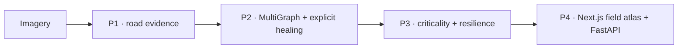

# Route Resilience

**Find the road junctions a city can least afford to lose.**

Route Resilience converts satellite imagery into a routable road graph, flags inferred/healed links, ranks structural chokepoints and shows how junction or area failures change routing and global efficiency.

[Open the public dashboard](https://trace.tiwaribabu.in) · [Setup](SETUP.md) · [Evaluation](docs/Evaluation.md) · [Current work](docs/Tracker.md)

> **Status (2026-07-26):** the Streamlit/Folium presentation has been replaced by a static Next.js/React field atlas and a thin FastAPI boundary. P2/P3 evidence was regenerated from a 573-node/828-edge MultiGraph, browser/API release gates pass, and mask model v3.2 remains production because the higher-scoring graph-first candidate lacks a deployable upstream license. The exact live Oracle/Modal ref/checksum still requires the O1 operator audit.

## What it does



- **P1:** pretrained PyTorch road segmentation with tiled/Hann inference, GeoTIFF/PAN reading, optional probability maps and provenance.
- **P2:** skeletonization, parallel-edge-preserving MultiGraph extraction, simplification and probability/geometry-aware gap healing.
- **P3:** betweenness, articulation points/bridges and global-efficiency failure analysis.
- **P4:** a responsive MapLibre field atlas with Explore/Stress/Compare/Recover modes, rerouting, exports, methodology, and queued imagery analysis.

The system is designed to recover useful continuity under occlusion and fragmentation, but it does not claim literal knowledge of every hidden road. Inferred links are marked and model evidence is reported with its limitations.

## Current evidence

### Mask-model development evidence

SpaceNet-5 Mumbai has been repeatedly consulted, so these are **development-benchmark**, not untouched-test, results. RGB→gray is a PAN proxy, not real Cartosat PAN.

| Checkpoint | Development-selected threshold | RGB IoU | Gray-proxy IoU | Legacy tile-mask APLS |
|---|---:|---:|---:|---:|
| **v3.2** `road_pan.pt` | 0.52 | **0.4594** | **0.4177** | **0.4987** |
| v3/v3.1 weights | 0.50 | 0.4493 | 0.4046 | 0.4374 |
| v1 weights | 0.50 sweep result | 0.3993 | 0.3447 | 0.4198 |

The released v1 deploy threshold is `0.44`; its row above is a development sweep at `0.50`, not the v1 release protocol. Exact fixed-threshold tables and source JSON are in [Evaluation.md](docs/Evaluation.md).

### Graph-first research evidence

On the strict common-unit chip/vector-GT gate (127/127 chips), A18-LoRA raw APLS was `0.1051` vs v3.2 `0.0121`; the paired delta was `+0.0930`, CI `[+0.0782,+0.1095]`. Normalized by each chip’s GT-self ceiling, A18-LoRA captured about **18%** of achievable routing—roughly twice the frozen A18 result, but still far below deploy quality.

Do not compare those absolute chip scores to the legacy tile-mask APLS column above; they use different units and ground truth.

### Current committed Panaji sample

- 573 nodes / 828 edges; 24 closed rings retained
- build-time healing: 8 → 3 components; five bridges added, four surviving final inferred edges
- 100 articulation nodes / 90 structural bridges
- APLS vs cached OSM truth: `0.5534`
- 40-step targeted RI: mean `0.7526`, end `0.5532`; seed-43 random reference mean `0.8912`, end `0.6917`

Multi-step failure now isolates failed nodes while preserving the baseline node universe, so RI remains comparable and bounded. The current graph, resilience, flood and percolation evidence is regenerated and fingerprinted in `data/sample/panaji_demo_evidence_manifest.json`; older curve artifacts are superseded.

## Quickstart — sample field atlas

Python 3.11 and Node.js 22:

```bash
python -m venv .venv
# Linux/macOS: source .venv/bin/activate
# Windows PowerShell: .venv\Scripts\Activate.ps1
python -m pip install --upgrade pip==24.2
python -m pip install -r deploy/requirements-app.txt
cd web
npm ci
npm run build
cd ..
python -m uvicorn src.app.api:app --host 127.0.0.1 --port 8000
```

Open `http://127.0.0.1:8000`. The committed sample needs no model, GPU, or Modal secret. **Analyze imagery** requires `MODAL_SEG_URL` and `MODAL_SEG_KEY`.

## Run your own image through P1→P3

Install the full environment from [SETUP.md](SETUP.md) and download `road_pan.pt` from the [`a4-roadseg-v3.2` model release](https://github.com/Akshat-Tiwari69/Trace/releases/tag/a4-roadseg-v3.2) into ignored `models/`.

```bash
python -m src.pipeline.run_pipeline \
  --image data/raw/your_tile.tif \
  --checkpoint models/road_pan.pt \
  --aoi your_area \
  --resolution-m 1.0 \
  --postprocess
```

Blended Hann inference is the default. GeoTIFF CRS/transform is carried into metric graph construction. For PNG/JPEG or another non-georeferenced source, `--resolution-m` is the ground-sample-distance assumption and currently defaults to `1.0` m/px; set it explicitly when real metric lengths matter.

Stage CLIs:

```bash
python -m src.pipeline.p1_segment.predict --help
python -m src.pipeline.p2_graph.build_graph --help
python -m src.pipeline.p3_analysis.analyze --help
```

## Evaluation entry points

```bash
# Mumbai mask-model development benchmark
python -m src.pipeline.p1_segment.eval_spacenet --help

# Legacy tile mask→graph APLS
python -m src.pipeline.p1_segment.apls_eval --help

# Strict same-chip v3.2 vs graph-first promotion gate
python -m src.pipeline.p1_segment.chip_apls_eval --help

# Committed Panaji sample reports
python -m src.pipeline.p3_analysis.evaluate --aoi panaji_demo --sample-dir data/sample
python -m src.pipeline.p3_analysis.apls --aoi panaji_demo --sample-dir data/sample
```

Read [Evaluation.md](docs/Evaluation.md) before comparing outputs.

## Repository map

```text
src/pipeline/p1_segment/   model, inference, data, training and evaluation
src/pipeline/p2_graph/     skeleton/MultiGraph, simplification, healing and IO
src/pipeline/p3_analysis/  criticality, resilience, APLS and scenarios
src/pipeline/run_pipeline.py
src/app/                   FastAPI, domain service, Modal client and upload queue/analysis
web/                       Next.js/React/MapLibre field atlas and browser tests
data/sample/               committed demo contracts and evidence
deploy/                    Oracle/Modal/Caddy/systemd configuration
docs/                      product, architecture, evidence, research and coordination
tests/                     CPU/unit/contract/application tests
```

## Product boundaries

- Next.js/React owns presentation; FastAPI exposes the maintained Python domain pipeline and serves the static export.
- No database or user-login product without a separate demonstrated need.
- PyTorch and pretrained fine-tuning only.
- Resilience is based on global efficiency and must preserve the baseline node universe.
- P2/P3/dashboard remain CPU-capable; training/hosted P1 may use GPU.
- Raw/provider imagery, restricted data, secrets and checkpoints are not committed.
- Negative results and benchmark limits are recorded rather than hidden.

## Tests

```bash
python -m pytest tests/ -q
```

CI runs Python tests and production dependency smoke plus TypeScript, lint, unit, static-build, bundle-budget, Playwright, responsive, and axe gates.

## Current roadmap

1. **A44 (complete):** reconcile documentation and evidence.
2. **A45 (complete):** fix resilience/inference protocol correctness, simplify code and measure performance.
3. **A46 (complete):** graph-first candidate passed the routing gate but was blocked from deployment by its missing upstream license.
4. **F9 (release ready):** researched Next.js/React/MapLibre experience and FastAPI replacement verified locally.
5. **O1/X1 (active):** immutable live rollout verification and final demo capture.

See [Tracker.md](docs/Tracker.md) for status and [bugs.md](bugs.md) for the current issue ledger.

## Licensing and data

OSM, DeepGlobe, SpaceNet, Esri/provider imagery, Cartosat and any upstream model code each have separate terms. Raw/provider imagery is not redistributed; dataset use and limitations are recorded in [Research.md](docs/Research.md).

This repository currently has **no top-level code license**, so do not assume permission to reuse or redistribute the project code. Selecting a code license is tracked as `LEGAL-1` in [bugs.md](bugs.md).
