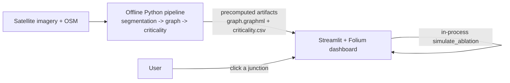

# Design.md

> **Purpose.** This document defines the visual design and user-experience standards for the **Route Resilience** dashboard — the map-first web app that shows the road network, highlights critical junctions, and lets a user simulate a junction failure. It keeps the UI legible for non-technical users, consistent across screens, and quick to build. Read alongside `PRD.md` (what/why), `TRD.md` (stack/architecture), and `UserJourney.md` (flows). Design decisions here follow the project's actual stack — **Streamlit + Folium, pure Python** — not a custom JS frontend.

> **Design scope.** v1 is a **single Streamlit + Folium dashboard** driven by **precomputed artifacts**: the road network, the criticality heatmap, region drilldown, the resilience metrics, and the click-a-junction-to-disable simulation. Screens marked *Future* below (flood-polygon simulator, mobile companion, a separate extraction-debug view) are **aspirational / out of v1 scope**. Numbers in mockups are **illustrative placeholders**.

---

## 1. Vision & Philosophy

- **Map is the hero.** The interactive map dominates the UI, with roads coloured by criticality. Panels and charts support the map and never distract from it.
- **Mission-control tone.** Calm, authoritative, data-focused — inspired by operations-centre UIs. A neutral dark theme; **no flags or patriotic motifs**.
- **Colour means data.** Colour is reserved for encoding information (criticality, status), never decoration. The criticality ramp is a **colourblind-safe sequential scheme (Viridis / cividis)**; semantic states are also labelled so meaning never depends on colour alone.
- **Clarity & accessibility.** Clean, legible type (Inter), comfortable sizes for non-technical users, WCAG AA contrast (≥ 4.5:1), and plain-language tooltips for every metric.
- **Honest about uncertainty.** Inferred/healed roads are shown distinctly (e.g. dashed lines) so users can tell observed roads from reconstructed ones.

## 2. Visual Identity

- **Colour scheme:** dark base (background `#121212`, panels `#1E1E2E`). **Criticality ramp:** low → high as blue → teal → yellow (Viridis/cividis — colourblind-safe). **Semantic palette:** normal road = grey, selected = cyan, rerouted path = orange, disabled junction = red (always paired with an icon). Every colour-coded element carries a label or icon.
- **Typography:** a neutral sans-serif (Inter or system font). Hierarchy: titles 26–28 px bold, section headers 18–20 px semibold, body 14–16 px, captions 12 px. Metric numbers use **tabular figures** so they align. No more than **3 sizes per screen**.
- **Iconography:** simple glyphs from a standard set (Material/Font Awesome style) that reinforce meaning — e.g. a "!" on critical nodes. No decorative imagery.

## 3. Layout & Architecture

Map-centric two-column layout: the **map ~65%** (left), a **control panel ~35%** (right). Key metrics (Resilience Index, travel-time impact) sit atop the panel; a persistent legend overlays the map bottom-left. On wide screens (1920×1080+) the map spans most of the viewport; on a laptop (1366×768) panels may stack **below** the map to stay readable.

**How the dashboard fits the system (matches `TRD.md`):** the heavy work happens **offline** in the Python pipeline; the dashboard is a thin **read layer** over precomputed files. The only thing it computes live is the cheap node-ablation simulation.

No separate backend service, database, REST API, or login in v1 — the dashboard reads files and calls an in-process function.

## 4. Screens & Mockups

### 4.1 Main Dashboard — Map-First *(v1 core)*
The landing screen: a full-screen dark basemap with roads coloured by the criticality heatmap. Top: key metrics (overall **Resilience Index**, **average travel-time impact**). Right panel: scenario dropdown (flood / accident / closure), region selector, layer toggles. Bottom-left: the colour-ramp legend. Hovering/clicking a road or junction shows a tooltip (name + criticality). Clicking a junction lets the user **disable** it ("Simulate Road Closure"), after which the map re-colours and the metrics + rerouted path update.
- **Flow:** load → city overview → zoom/pan → click a junction to disable → see instant re-colour + updated index + reroute.
- **Mockup prompt:** *"High-tech navigation dashboard, interactive city map, roads in a heatmap colour ramp on a dark basemap, sleek dark UI panels with metrics and a dropdown, clean flat style."*

### 4.2 Region Drilldown *(v1)*
On region selection the map zooms in and the panel lists the **Top 5 Critical Nodes** for that area (sortable, each with an icon + score). Hovering a list item highlights the road on the map; a small bar chart shows critical nodes per sub-zone.
- **Flow:** select region → see ranked hotspots → click an item to centre the map → optionally disable it.

### 4.3 Criticality Analysis *(v1)*
The panel shows the headline **Resilience Index** plus two charts: travel-time increase vs. number of roads closed (line), and top delays by road (bar). Charts update instantly when a node is disabled, and use colourblind-safe palettes with labels.
- **Mockup prompt:** *"Data-analytics panel beside a map, a line chart and a bar chart of road-network resilience metrics, clean 2D flat style."*

### 4.4 Road-Extraction View *(optional / developer)*
Overlays the model-detected roads (thin lines) on the raw satellite image, with an opacity slider, so the team (or a curious user) can verify extraction quality and spot gaps. Mainly a debugging/transparency view.

### 4.5 Future screens *(out of v1 scope)*
- **Disaster (flood-polygon) simulator:** draw a flood polygon; the map closes affected roads and shows rerouting. *Aspirational.*
- **Mobile companion:** a stripped-down map + current Resilience Index for field teams. *Out of v1 scope (PRD marks mobile out of scope); kept here as a future idea.*

## 5. Component Library

Reusable blocks, each with states and the **v1 (Streamlit/Folium)** implementation.

| Component | Purpose | States | v1 implementation |
|---|---|---|---|
| **Map canvas** | Show roads + layers | loading, idle, error | `folium.Map` via `streamlit-folium` |
| **Road segment** | One road, coloured by criticality | normal, selected, disabled | `folium.PolyLine` |
| **Intersection marker** | A junction (clickable) | default, hovered, disabled | `folium.CircleMarker` |
| **Metric card** | A key number (e.g. Resilience Index) | normal, alert | `st.metric` |
| **Legend / colour bar** | Explain the criticality ramp | static | `branca` colormap / custom HTML |
| **Top-critical list** | Ranked nodes + scores | hover-highlight, sortable | `st.dataframe` |
| **Scenario selector** | Pick flood/accident/closure | default, open, selected | `st.selectbox` |
| **Disable-node control** | Trigger the simulation | enabled, processing | map click (`st_folium`) + `st.button` |
| **Loading indicator** | During recompute | active, done | `st.spinner` |

*Empty/error states:* every component degrades gracefully — "no simulation running", "no data for this area", a spinner during compute — rather than showing a blank or a stack trace.

**Mapping-library note (for future reference only):** v1 uses **Folium / Leaflet via Streamlit** (pure Python, matches `TRD.md`). The table below compares JavaScript mapping libraries that would only be relevant if the product later moved to a custom JS frontend — **not part of v1**.

| Library | 2D/3D | Use case | License |
|---|---|---|---|
| Leaflet | 2D | simple maps, many plugins | open (BSD) |
| Mapbox GL JS | 2D + extruded 3D | modern vector maps | proprietary (free tier) |
| deck.gl | 2D/3D GPU | very large datasets on WebGL | open (MIT) |
| CesiumJS | 3D globe | global/terrain views | open (Apache) |
| ArcGIS JS | 2D/3D | enterprise GIS | commercial (Esri) |

## 6. Interaction & Motion

Motion is subtle and purposeful:
- **Transitions:** smooth map pan/zoom (Leaflet default); keep a plan (top-down) view.
- **Loading:** a spinner/overlay on affected components during a recompute (e.g. "Simulating…" when a junction is disabled).
- **Highlight changes:** when a new rerouted path appears, briefly emphasise it (draw it last / slightly thicker) so the eye catches it.
- **Avoid overuse:** no gratuitous animation; chart/metric updates are instant.

*Feasibility note:* some effects (custom blur, animated line "drawing", custom gauges) aren't native to Streamlit and may need custom CSS/HTML or a small component. Treat them as design intent; for v1, approximate with what Streamlit + Folium support cleanly and don't let styling block the core interaction.

## 7. Accessibility & Performance

- **Keyboard & screen reader:** controls reachable via keyboard; `aria-label`s on buttons; note Streamlit's a11y limits and avoid colour-only controls.
- **Colour & contrast:** never colour alone — critical nodes also get an icon; text meets WCAG AA (≥ 4.5:1), checked with a contrast tool.
- **Text alternatives:** a short caption near the map explains the colour ramp ("brighter = more critical"); tooltips give names + values.
- **Performance (v1 reality):** the dashboard works against **precomputed GeoJSON/CSV** for one AOI, so it stays light. Precompute betweenness once (k-sample for large graphs); cache loads with `st.cache_data`; keep the rendered graph to a reasonable AOI size. Heavy WebGL rendering of whole cities is a *future-frontend* concern, not v1.

## 8. Data-Visualization Standards

Follow cartographic good practice: Web Mercator (EPSG:3857) for city/regional scale, clear legend + title alignment, inline labels where possible, and no decorative 3D that obscures data. Every gauge/chart has a tooltip explaining its units. Charts use the same colourblind-safe palette as the map.

## 9. Implementation Notes

- **Frontend (v1):** Streamlit + Folium (`streamlit-folium`); charts via Matplotlib or Plotly; `branca` for the colour legend. Consumes **precomputed GeoJSON + CSV** — deliver against sample/mock artifacts first, then wire to real outputs.
- **No separate backend / DB / auth in v1** (see `TRD.md`): the pipeline is offline Python (PyTorch for segmentation, NetworkX for graph/criticality); the dashboard reads files and calls an in-process simulate function.
- **Reproducibility:** optional `Dockerfile` + pinned deps so the app runs identically elsewhere; a free CPU host (Streamlit Community Cloud / Hugging Face Spaces) can serve the precomputed dashboard.
- **Future option (not v1):** a React + deck.gl frontend with a FastAPI + PostGIS backend, only if the product outgrows Streamlit.

## 10. Timeline

Timeline, milestones, and deliverables are owned by **`Implementation.md`** (single source of truth) and tracked in **`Tracker.md`** — not duplicated here. The dashboard is built in the frontend workstream against precomputed/mock artifacts, so it can progress in parallel without waiting on the model.