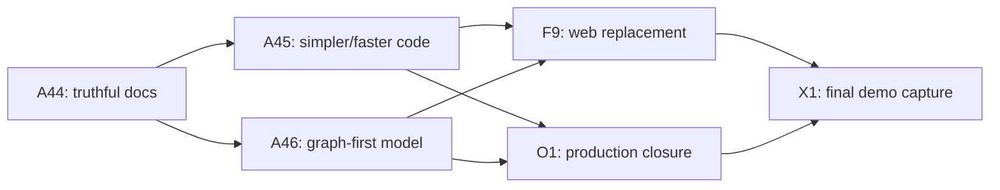

# Implementation.md — Current Execution Plan

> This document describes the **current** delivery sequence. `Tracker.md` owns live status and task assignment; this file explains why the work is ordered this way and what each phase must prove.

## Current baseline

The original build is complete:

- P1 segments imagery with the deployed v3.2 checkpoint and preserves georeference/provenance plus an optional probability sidecar when blended inference produces it.
- P2 produces a healed, simplified NetworkX MultiGraph with geometry, inferred-edge annotations and confidence when a probability map is available.
- P3 computes criticality, articulation/bridge evidence, global-efficiency resilience and failure scenarios; APLS is a separate evaluation path.
- P4 is a static Next.js/React/MapLibre field atlas served by FastAPI, with a committed sample path and an upload path backed by Modal P1 plus queued in-process P2/P3 analysis.
- CI runs the Python suite and production graph smoke plus web type, lint, unit, production-build and bundle-budget checks.

The release candidate is complete; the current phase is **immutable rollout and live verification**.

## Team and review ownership

| Area | Primary reviewer |
|---|---|
| ML, data, evaluation, integration, deployment coordination | Akshat |
| Graph extraction, graph IO, APLS, criticality and resilience | Shaivi |
| Web/API behavior, accessibility and visual design | Saanvi |

Akshat authorized repository-wide coordinator changes for the A44–A46/F9 program on 2026-07-13. Primary reviewers still review their areas.

## Delivery sequence

### A44 — Documentation reconciliation

Remove pre-build language and make every current-state document agree with the implementation, releases and remote Git state.

Done when:

- `Tracker.md` routes to real active work.
- PRD, TRD, Schema, Design and UserJourney describe the shipped product.
- README, SETUP and deploy instructions use real paths, tags and commands.
- Evaluation/Research distinguish validated results, negative results and hypotheses.
- RiskRegister lists current risks rather than solved setup risks.
- Documentation links and the full test suite pass.

### A45 — Repository simplification and performance

Profile before changing. Remove duplication and dead paths, reduce large-module responsibility, and improve hot paths only where a benchmark demonstrates value.

Required gates:

- Existing behavior tests remain green; add characterization tests before touching ambiguous behavior.
- Report lines/modules removed or responsibility reduced; do not reward line-count reduction that obscures logic.
- Benchmark the affected path before and after on representative sample and large synthetic inputs.
- Preserve §4 artifact contracts and deployment dependency boundaries.
- Keep rejected research code quarantined from production imports; delete it only when its evidence remains documented and no reproducibility contract depends on it.

### A46 — Graph-first model improvement

Continue from the A18-LoRA result rather than restarting the mask-model search. The immediate question is whether better encoder adaptation, training coverage and graph context can raise common-unit routing while preserving reproducibility and licensing safety.

Required gates:

- Same frozen chips, vector ground truth, coordinate frame and coverage as the strict chip APLS evaluator.
- Paired uncertainty interval excludes zero in favor of the candidate.
- Absolute fraction of achievable routing improves materially, not only the relative ranking.
- New geography/sensor evidence is kept separate from the repeatedly consulted Mumbai development benchmark.
- A deploy candidate must also pass runtime, checkpoint compatibility, provenance and rollback checks.

### F9 — web experience replacement

F9 replaced Streamlit/Folium with a researched, performance-budgeted Next.js/React/MapLibre frontend and the thinnest FastAPI boundary that exposes the maintained P1–P3 capabilities. The old presentation code and dependencies are removed; domain logic remains in Python.

Implementation gates:

- Browser-verified desktop and narrow-screen flows.
- Keyboard-accessible alternatives for map-only interactions.
- Clear separation of sample exploration, uploaded-image jobs, method/evidence and exports.
- No regression in job recovery, map state, scenario correctness or production dependency smoke.
- Static JavaScript/CSS/font bundle budgets pass; O1 measures live Core Web Vitals and map-frame behavior from the public deployment.
- Updated `Design.md` and `UserJourney.md` in the same PR.

### O1/X1 — Operational closeout

O1 applies and verifies the immutable release on the live services. X1 captures the final approved sample and upload flows after O1 is complete.

## Release and branch policy

- Each task uses a branch from current remote `dev` and a focused PR back to `dev`.
- `main` is a human-controlled stage gate; agents never target or merge it.
- Application production uses an approved immutable tag or commit, not moving `dev`.
- Model releases include checkpoint checksum, architecture metadata, threshold, evaluation evidence and compatibility notes.

## Definition of “better”

- **Documentation:** shorter, current, non-duplicative and verifiably correct.
- **Code:** easier to follow with equal behavior; performance claims require measurements.
- **Model:** common-unit routing improves with paired evidence and no hidden frame/data leakage.
- **UI:** task completion and comprehension improve in real browser flows, not only in screenshots.
- **Operations:** the exact approved ref is live, health-checked and recoverable.
