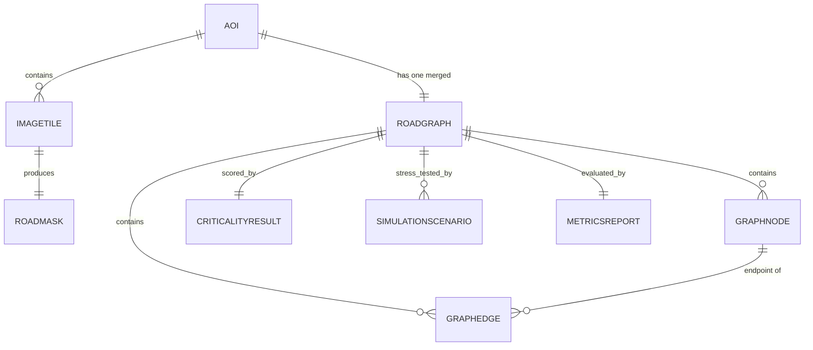

# Schema.md

> **Purpose.** This document defines the **data architecture** of Route Resilience: the data objects (entities), the on-disk formats that store them, how they relate, the rules that keep them valid, and how data moves through its lifecycle. Because the project is a **file-based geospatial pipeline** (no relational database — see `TRD.md`), "tables" here mean **structured artifacts** (GeoTIFFs, masks, a graph file, metric files) rather than SQL tables. The schema is modelled so it could later be lifted into PostGIS unchanged if the project becomes a hosted service.

---

## Entity Definitions

Plain English: an "entity" is just a *thing the system keeps track of*. Here are ours.

| Entity | What it is | Key attributes |
|---|---|---|
| **AOI** (Area of Interest) | A city/region being analyzed | `aoi_id`, `name`, `bbox`, `crs` |
| **ImageTile** | One satellite image patch | `tile_id`, `aoi_id`, `source` (Sentinel-2/LISS-IV/Cartosat-3), `resolution_m`, `path`, `crs`, `transform` |
| **RoadMask** | Binary road/not-road image from Phase I | `mask_id`, `tile_id`, `path`, `model_version`, `threshold` |
| **RoadGraph** | The routable network for an AOI (the core entity) | `graph_id`, `aoi_id`, `node_count`, `edge_count`, `crs` |
| **GraphNode** | An intersection or endpoint | `node_id`, `geometry` (lat/lon), `degree`, `type` (intersection / endpoint / bridged), `betweenness`, `is_critical`, `is_disabled` |
| **GraphEdge** | A road segment between two nodes | `edge_id`, `u`, `v`, `geometry`, `length_m` (weight), `is_bridged`, `edge_betweenness` |
| **CriticalityResult** | Centrality scores + ranking for a graph | `graph_id`, per-node/edge scores, `rank` |
| **SimulationScenario** | One node-ablation stress test | `scenario_id`, `graph_id`, `disabled_nodes[]`, `resilience_index`, `travel_time_delta_pct`, `largest_cc_fraction` |
| **MetricsReport** | Evaluation results for a model/graph | `iou`, `dice`, `occlusion_recall`, `connectivity_ratio`, `apls`, `relaxed_iou` |

## Data Stores ("Tables", adapted to files)

| Store (directory) | Contents | Format |
|---|---|---|
| `data/raw/` | Source imagery, OSM extracts | GeoTIFF, OSM PBF/GeoJSON *(git-ignored)* |
| `data/interim/` | Image tiles, label masks | GeoTIFF, PNG/NPY |
| `data/processed/` | Road graph, criticality scores | **GraphML** or **GeoPackage**, CSV/Parquet |
| `data/outputs/` | Exports, scenario results, reports | GeoJSON, JSON/CSV |
| `models/` | Trained model checkpoints | `.pt`/`.pth` *(git-ignored)* |

**Core graph schema (GraphML / GeoPackage):**

```
Node:  node_id (int, unique) | x, y (float) | degree (int)
       | type (str) | betweenness (float 0–1) | is_critical (bool) | is_disabled (bool)
Edge:  u (int) | v (int) | length_m (float > 0) | geometry (LineString)
       | is_bridged (bool) | edge_betweenness (float 0–1)
```

## Relationships



In words: an AOI has many image tiles; each tile produces one mask; the masks for an AOI combine into one road graph; the graph contains many nodes and edges; the graph is scored once (criticality), evaluated once (metrics), and stress-tested many times (one scenario per simulation).

## Constraints

- `node_id` is **unique** within a graph; every edge's `u`/`v` must reference **existing** nodes (no dangling edges).
- `crs` must be **consistent** across an AOI's tile, mask, and graph (mismatched coordinate systems are the classic bug — see `Research.md`).
- All node/edge geometry must fall **within the AOI bbox**.
- `length_m` (edge weight) must be **> 0**.
- `betweenness` / `edge_betweenness` are **normalized to [0, 1]**.
- `type` ∈ {intersection, endpoint, bridged}; `is_bridged` true only for edges added by the healing step.

## Indexes

(Not SQL indexes — the equivalents that keep lookups fast.)

- **Spatial index** (R-tree via `geopandas`/`rtree`) over nodes and edges → fast "what's near this click?" map queries.
- **Node-id lookup** (Python dict) → O(1) access to a node by id during simulation.
- **Sorted criticality index** → instant "Top-N critical nodes" for the dashboard list.

## Validation Rules

- Mask pixels are strictly **binary {0, 1}**.
- Graph **connected-component count** is recorded before and after healing (drives the Connectivity Ratio metric).
- **No self-loops** unless intentional; **no duplicate edges** between the same node pair.
- **Bridged edges flagged** (`is_bridged = true`) so inferred roads are distinguishable from observed ones everywhere downstream (including the dashboard).
- All **required fields present** before an artifact is written (fail fast, with a clear message).
- Coordinates within bounds; weights positive; betweenness in range.

## Data Lifecycle


- **Raw** imagery and **model checkpoints** are **git-ignored** (too large / restricted-license); only small **sample** data is committed so the repo runs out of the box.
- **Processed** graphs and metrics are small and reproducible, so they can be committed or regenerated.
- **Cloud storage is ephemeral** — checkpoints and important artifacts are saved off-device (Drive/Kaggle Datasets) as noted in `Research.md`.
- Re-running the pipeline on the same raw input + same config + fixed seed must reproduce the same processed artifacts (reproducibility requirement from `TRD.md`).
