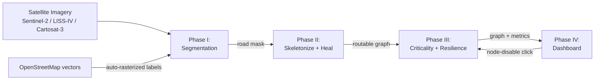

# TRD.md

> **Purpose.** This Technical Requirements Document defines *how* **Route Resilience** is built: the system architecture, the technology stack for each part, how data is stored and moved, the interfaces between components, and the performance, security, and deployment requirements. Where a typical web app would have a database, login system, and REST API, this project is a **file-based geospatial ML pipeline plus an interactive read-only dashboard** — so those sections are adapted honestly rather than forced. Read alongside `PRD.md` (what/why) and `Research.md` (evidence behind the choices).

---

## System Architecture

Route Resilience is a **modular, loosely-coupled pipeline** of four processing stages followed by an interactive dashboard. Each stage hands off to the next through a **file artifact** (a saved mask, a saved graph, a metrics file), so the stages can be built, run, and debugged independently — and by different people in parallel.

Plain English: think of it like an assembly line. Each station does one job and puts its output on the belt; the next station picks it up. Nobody has to wait for the whole line to be finished to work on their station.



Component responsibilities:

| Component | Job | Output artifact |
|---|---|---|
| **Data Ingestion** | Load/clip/tile imagery; build OSM training masks | image tiles, label masks |
| **Phase I — Segmentation** | Predict road pixels (occlusion-robust) | binary road mask |
| **Phase II — Graph Build & Healing** | Skeletonize → graph → MST/Union-Find healing | routable weighted graph |
| **Phase III — Network Analysis** | Betweenness, node ablation, global-efficiency Resilience Index | graph + criticality metrics |
| **Phase IV — Dashboard** | Visualize; run interactive node-disable simulation | (interactive UI) |

The pipeline (Phases I–III) runs **offline/batch**. The dashboard (Phase IV) is a thin **read layer** that loads the precomputed artifacts; the only thing it computes live is the cheap node-ablation simulation when a user clicks.

## Frontend Stack

The frontend is the dashboard. It is **pure Python** so the whole team can work in one language and no separate JavaScript build is needed.

| Tool | Role |
|---|---|
| **Streamlit** | App framework — turns a Python script into a web app |
| **Folium** (Leaflet.js under the hood) | Interactive slippy map |
| **streamlit-folium** | Bridge that renders the map *and returns what the user clicked* (enables click-to-disable) |
| **branca** | Colour ramps and the criticality legend/colour bar |
| **Matplotlib / Plotly** | Side charts (e.g. resilience-vs-nodes-removed curve) |

Design standards for the frontend live in `Design.md` (owned by the frontend lead).

## Backend Stack

"Backend" here means the **processing pipeline**, not a running server — in the prototype there is no separate backend service. It is a set of Python modules run as scripts/notebooks.

| Layer | Tools |
|---|---|
| Language | Python 3.10+ |
| Deep learning | PyTorch, `segmentation_models_pytorch`, HuggingFace Transformers (SegFormer) |
| Augmentation / loss | Albumentations (incl. CoarseDropout for occlusion), clDice loss |
| Geospatial I/O | Rasterio, GDAL, GeoPandas, OSMnx |
| Image processing | OpenCV, scikit-image (skeletonize) |
| Graph build & analysis | sknw (skeleton→graph), NetworkX (graph + centrality + efficiency) |
| Numerical | NumPy, SciPy (KD-tree for healing candidates) |

## Database Strategy

**Decision: no traditional database in the prototype.** The data is geospatial files and a graph, used in a single-machine, batch, read-mostly way. A relational database would add setup, schema migrations, and a running service for zero benefit at this stage. Instead we use a **structured file-based artifact store** — a versioned `data/` directory tree.

```
data/
  raw/        # downloaded imagery (GeoTIFF), OSM extracts   (git-ignored)
  interim/    # image tiles, label masks
  processed/  # graphs (GraphML/GeoPackage), criticality (CSV/Parquet)
  outputs/    # exports (GeoJSON), metric reports (JSON)
models/       # trained checkpoints                          (git-ignored)
```

Formats: **GeoTIFF** for imagery, **PNG/NPY** for masks, **GraphML or GeoPackage/GeoJSON** for the road graph, **CSV/JSON** for metrics. The full data schema is in `Schema.md`.

*When a real database would be justified (future):* a multi-user, multi-city hosted service would warrant **PostGIS** (PostgreSQL + spatial extension) for storing graphs and query-by-region. Noted as a future enhancement, deliberately out of scope now.

## API Design

There is **no external/REST API** in the prototype. The relevant "API" is the **contract between modules** — the function signatures and the file handoffs that let the phases stay decoupled. Defining these up front is what lets three people build in parallel.

Module contracts (illustrative):

| Phase | Function (contract) | In → Out |
|---|---|---|
| Ingestion | `tile_image(geotiff) -> [tiles]` | image → tiles |
| Ingestion | `osm_to_mask(aoi, transform) -> mask` | AOI + grid → label mask |
| Phase I | `predict(tile) -> mask_array` | tile → binary mask |
| Phase II | `build_graph(mask) -> nx.Graph` | mask → raw graph |
| Phase II | `heal(graph) -> nx.Graph` | broken graph → routable graph |
| Phase III | `criticality(graph) -> dict` | graph → centrality scores |
| Phase III | `simulate_ablation(graph, node) -> metrics` | graph + node → resilience metrics |

**Dashboard ↔ pipeline contract:** the dashboard reads `graph.graphml` + `criticality.csv` at startup; when the user clicks a node it calls the in-process `simulate_ablation(graph, node)` and renders the result. This call is cheap (one shortest-path/efficiency recompute on a copy of the graph), so it needs no server.

*Future:* a **FastAPI** service could expose `simulate_ablation` and graph queries over HTTP if the app is hosted for many users. Out of scope now.

## Authentication

**Decision: none required in the prototype.** It is a single-user, locally-run (or single public-demo) application that handles only **open, non-personal geospatial data** — there is nothing to protect with a login. Adding auth now would be over-engineering.

*Future:* if deployed as a multi-user municipal/government service, add authentication (e.g. OAuth/SSO via the hosting platform) and role-based access. Explicitly out of scope for this release so the decision is deliberate, not an oversight.

## Security Architecture

Even without user accounts, basic security hygiene applies:

- **Input validation.** Only accept expected formats (GeoTIFF imagery, GraphML/GeoJSON graphs); reject/ˇguard malformed files so the dashboard can't be crashed by a bad upload.
- **No secrets in the repo.** No API keys/credentials committed; use environment variables / a git-ignored config if any data portal keys are needed.
- **Dependency hygiene.** Pin versions (`requirements.txt`/`environment.yml`); avoid abandoned packages.
- **Data licensing & provenance.** Respect dataset licenses — OSM (ODbL), OpenSatMap (CC BY-NC-SA, non-commercial), SpaceNet/DeepGlobe (research terms), Cartosat-3 (restricted/on request). Record the source and license of every dataset used. Do **not** commit large or restricted raw data to git.
- **No PII.** The system processes satellite imagery and road geometry only — no personal data — which keeps the privacy/security surface small.
- **Safe file paths.** Sanitize any user-provided paths/filenames in the dashboard.

## Infrastructure Design

- **Training:** commodity 8 GB GPUs are sufficient for the realistic fine-tuning plan (see `Research.md` → Infrastructure & Hardware Feasibility for the exact settings). Free **Colab/Kaggle** (16 GB T4/P100) is the overflow for heavier runs.
- **Graph + dashboard:** CPU-only; runs comfortably on a modest laptop, including 8 GB RAM machines when working against precomputed artifacts.
- **Dev environment:** Python virtual environment (venv/conda), pinned dependencies, fixed random seeds for reproducibility. An optional `Dockerfile` can lock the environment exactly.

## Deployment Strategy

| Mode | How | Notes |
|---|---|---|
| **Local (primary)** | `streamlit run app.py` | The default for development and demos |
| **Public demo (optional)** | Streamlit Community Cloud or Hugging Face Spaces (free CPU tier) | CPU-only / limited RAM — so host the **dashboard with precomputed artifacts**; do model inference offline beforehand. Confirm current free-tier limits before relying on them. |
| **Reproducible build (optional)** | `Dockerfile` + pinned `requirements.txt` | For judges/contributors to run identically |

Because the dashboard consumes precomputed outputs, the free CPU hosting tiers are a natural fit — no GPU is needed at serve time.

## Performance Requirements

Tied to the non-functional requirements in `PRD.md`:

| Area | Requirement |
|---|---|
| Training memory | Fit in 8 GB VRAM: pretrained encoders only, AMP/FP16, batch 2–4 @512² (8–16 @256²) + gradient accumulation, gradient checkpointing for heavier encoders |
| Inference | Segment + build graph + analyze one city tile within minutes on a laptop |
| Dashboard responsiveness | Node-disable reroute should feel near-instant — sub-second to a few seconds on a city-scale graph |
| Scaling trick | Precompute betweenness once; on each click only recompute shortest paths / global efficiency on the perturbed graph; use NetworkX **k-sample** betweenness for very large graphs |
| Dashboard memory | Stay usable on 8 GB RAM by loading precomputed artifacts, not raw imagery |
| Reliability | Frequent checkpointing during training so a thermal shutdown loses ≤ 1 epoch |
