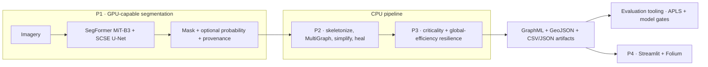
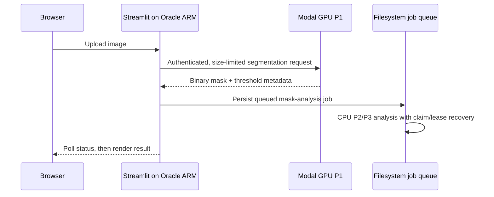

# TRD.md — Technical Architecture

> Current architecture of Route Resilience. Artifact details are owned by `Schema.md` and coordination contracts by `Tracker.md` §4.

## System overview

Route Resilience has one analysis pipeline and two ways to enter it.

```mermaid
flowchart LR
    subgraph P1["P1 · GPU-capable segmentation"]
      IMG[Imagery] --> SEG[SegFormer MiT-B3 + SCSE U-Net]
      SEG --> MASK[Mask + optional probability + provenance]
    end
    subgraph CPU["CPU pipeline"]
      MASK --> P2["P2 · skeletonize, MultiGraph, simplify, heal"]
      P2 --> P3["P3 · criticality + global-efficiency resilience"]
    end
    P3 --> ART[GraphML + GeoJSON + CSV/JSON artifacts]
    ART --> EVAL["Evaluation tooling · APLS + model gates"]
    ART --> P4["P4 · Streamlit + Folium"]
```

### Batch/local path

`python -m src.pipeline.run_pipeline` runs P1→P2→P3, verifies the P4 contract, records content/config signatures per stage and writes a success-only run summary. Stages may be resumed or forced.

### Hosted upload path

```mermaid
sequenceDiagram
    participant U as Browser
    participant S as Streamlit on Oracle ARM
    participant M as Modal GPU P1
    participant Q as Filesystem job queue
    U->>S: Upload image
    S->>M: Authenticated, size-limited segmentation request
    M-->>S: Binary mask + threshold metadata
    S->>Q: Persist queued mask-analysis job
    Q->>Q: CPU P2/P3 analysis with claim/lease recovery
    S-->>U: Poll status, then render result
```

The Modal endpoint is the only remote inference boundary. There is no database, user-login system or separately managed REST application backend. Queue persistence is intentionally single-host and file-based.

## Components

### P1 — segmentation and evaluation

- PyTorch + `segmentation-models-pytorch` SegFormer MiT-B3 encoder and SCSE U-Net decoder.
- Tiled inference with Hann blending, checkpoint-defined threshold/tile size, optional postprocessing and TTA.
- Rasterio-backed RGB, multispectral and one-band GeoTIFF/PAN reading with CRS/transform propagation.
- Checkpoint provenance, SHA-256 and stage signatures.
- Development evaluation on SpaceNet-5 Mumbai plus common-unit routing evaluation against A18 graph outputs.

The deployed checkpoint remains `a4-roadseg-v3.2`/`road_pan.pt` until a candidate passes the promotion and deployment gates.

### P2 — graph construction and healing

- Binary mask → skeleton/medial information → `sknw` → NetworkX `MultiGraph`.
- Positive metric edge lengths, preserved LineString geometry and parallel-edge keys.
- Stub pruning, degree-2 collapse, nearby-node consolidation and geometry simplification.
- Gap healing based on distance, direction, crossing constraints and optional P1 probability corridor support.
- Observed and inferred edges remain distinguishable.

### P3 — analysis

- Node betweenness, articulation points, graph bridges and optional percolation/demand variants.
- Baseline-normalized global-efficiency Resilience Index under targeted, random, flood or custom failures. Single-scenario and multi-step paths preserve the baseline node universe; current curve evidence was regenerated after the A45 correction.
- Exact or fixed-source sampled paths for larger graphs.
- Analyzed GraphML/GeoJSON and tabular criticality/resilience outputs.

APLS/topology utilities are housed in the P3 analysis package for reuse, but normal `analyze()`/`run_pipeline` does not execute them; they belong to the separate evaluation path shown in the diagram.

### P4 — dashboard

- Streamlit application with Folium maps and four top-level views: Briefing, Analysis, Your imagery and Methodology.
- Committed Panaji sample for a no-GPU/no-checkpoint start.
- Junction and multi-node/flood ablation, rerouting, rankings, curves and exports.
- Persistent single-host upload job queue with JSON state/results and process claims/leases.
- Modal transport isolated in `src/app/modal_client.py`; CPU upload analysis isolated in `src/app/upload_analysis.py`.

## Runtime and deployment

| Component | Runtime | Deployment |
|---|---|---|
| Training/evaluation | Python 3.11 + NVIDIA GPU when required | Local GPU, Colab or Kaggle |
| Modal P1 | Pinned Python/PyTorch GPU image | Modal, scales to zero |
| P2/P3/P4 | CPU, production dependency subset | Oracle Ubuntu ARM user service |
| TLS/reverse proxy | Caddy | Public 80/443; Streamlit should bind loopback 8501 |
| Updates | systemd timer + `deploy/update.sh` | Immutable application tag/full SHA only, health check and rollback |

The repository proves deployment code and CI smokes; `Tracker.md` O1 is required to prove the current live box matches it.

## Security boundaries

- Secrets exist only in environment/Modal secret stores.
- Modal authentication fails closed and is checked before app-level base64 decoding, image parsing and model work.
- Uploads are type- and size-limited before expensive processing; decoded-size limits account for base64 expansion.
- The public host should expose Caddy only; port 8501 is loopback-only.
- Model downloads are checksum-pinned.
- Uploaded job artifacts are transient and cleaned by age; the product is not a permanent data store.
- Rate limiting remains an explicit production operator item.

## Configuration and provenance

- `PipelineConfig` is the end-to-end source for pipeline settings; `GraphConfig` owns P2/P3 parameters and paths.
- Checkpoint metadata owns architecture, tile size and deploy threshold unless the caller explicitly overrides them.
- Content/config signatures invalidate stale stage outputs.
- `{aoi}_run.json` records successful stage timings, resolved configuration and available provenance.
- Production dependency pins are separate from the ML development environment by design.

## Performance expectations

| Path | Expectation |
|---|---|
| Sample dashboard load | Interactive on a modest CPU host |
| Junction simulation | Near-interactive for the committed sample; sampled/cached algorithms for larger graphs |
| Uploaded-image P2/P3 | Queued and bounded on the single ARM host |
| P1 inference | Remote GPU for hosted uploads; CPU remains supported for local batch use but is slower |
| Large imagery | Tiled/blended inference; source images still have explicit size limits |

Performance claims must be measured on representative inputs. A45 measurements and their limits are recorded in `Evaluation.md`; future changes must retain the same before/after discipline.

## Deliberate non-goals

- Database, accounts, multi-tenant storage or horizontal queue workers.
- Native mobile application.
- Live traffic/GPS integration.
- National-scale graph serving.
- Claiming final geographic/sensor generalization from the Mumbai development benchmark.
