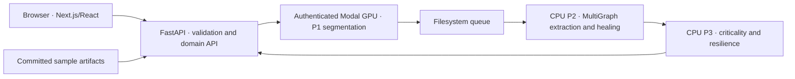
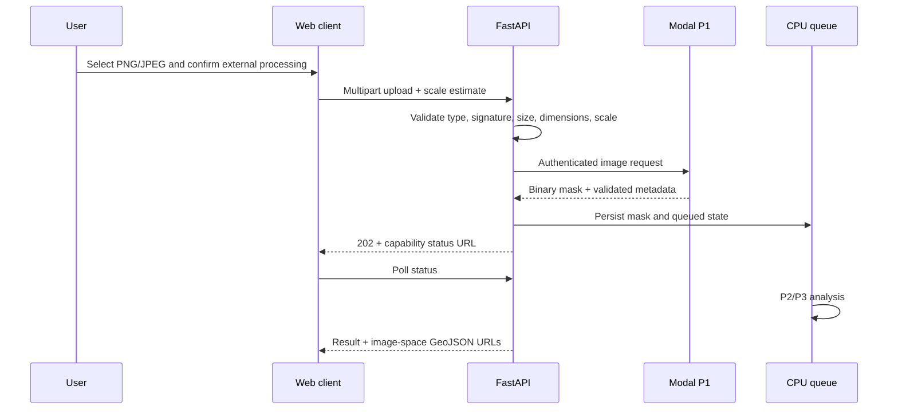
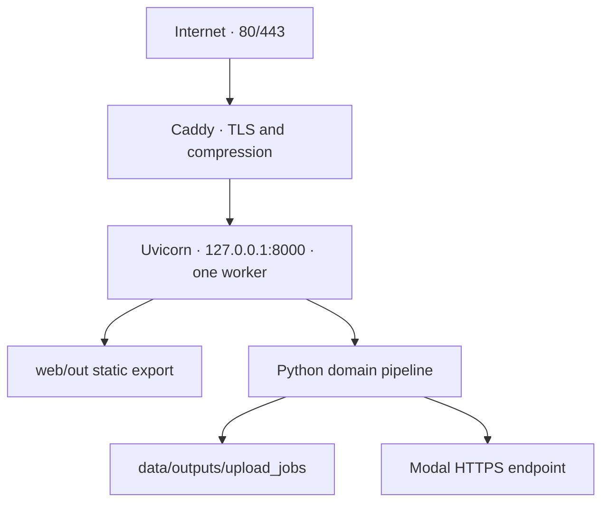

# TRACE technical reference

## System boundary

TRACE turns satellite imagery into a routable road graph and evaluates how efficiently that graph continues to connect places after junction failures.

```mermaid
flowchart LR
    B["Browser · Next.js/React"] --> A["FastAPI · validation and domain API"]
    A --> M["Authenticated Modal GPU · P1 segmentation"]
    M --> Q["Filesystem queue"]
    Q --> P2["CPU P2 · MultiGraph extraction and healing"]
    P2 --> P3["CPU P3 · criticality and resilience"]
    P3 --> A
    S["Committed sample artifacts"] --> A
```

The browser is a presentation client. Python remains authoritative for graph construction, criticality, APLS, resilience, and uploaded-image analysis.

## Runtime components

| Component | Technology | Responsibility |
|---|---|---|
| Web client | Next.js 16, React 19, TypeScript | Static application shell, accessible controls, export, client state |
| Map | MapLibre GL JS | Data-driven rendering of the authoritative GeoJSON |
| Application API | FastAPI/Uvicorn, one worker | Artifact reads, simulation, upload validation, queue status/results, static files |
| GPU inference | Modal-hosted PyTorch endpoint | Authenticated P1 road-mask inference only |
| CPU analysis | NetworkX, GeoPandas/Shapely, scikit-image/sknw | P2 graph construction and P3 analysis |
| Persistence | Versioned repository artifacts and short-lived queue files | Reproducible sample evidence and restart-safe upload jobs |
| Edge/TLS | Caddy | HTTPS, compression, request-size ceiling, reverse proxy |
| Process control | systemd | Loopback-only app service and immutable update service |

No database or login service is part of the product.

## Pipeline

1. **P1 segmentation** fine-tunes and serves a pretrained PyTorch model. The production model remains `a4-roadseg-v3.2` until a licensed candidate passes the registered routing gate.
2. **P2 graph construction** converts a binary mask into a `networkx.MultiGraph`, preserves parallel branches and closed rings, samples confidence, heals only corridor-supported gaps, simplifies safely, and writes matching GraphML/GeoJSON artifacts.
3. **P3 analysis** annotates node/edge criticality, articulation structure, APLS, percolation, flood scenarios, and baseline-normalized global-efficiency ablation curves.
4. **Application delivery** exposes committed sample artifacts and deterministic live simulations to the web client.

## Public API

All endpoints are same-origin in production.

| Method/path | Purpose | Cache |
|---|---|---|
| `GET /healthz` | Process readiness | no cache |
| `GET /api/v1/aois/{aoi}` | Sample metadata, criticality, resilience curve, evidence | short public cache |
| `GET /api/v1/aois/{aoi}/graph` | Authoritative GeoJSON | immutable/ETag |
| `POST /api/v1/simulations` | Deterministic CPU node-removal scenario | no store; bounded LRU server cache |
| `POST /api/v1/analyses` | Validate image, call Modal P1, enqueue P2/P3 | no store |
| `GET /api/v1/analyses/{id}` | Queue status and capability URLs | no store |
| `GET /api/v1/analyses/{id}/result` | Completed metrics and criticality | no store |
| `GET /api/v1/analyses/{id}/graph` | Uploaded image-space graph | no store |

AOIs and job IDs are validated before path construction. Public errors do not expose secrets, local paths, upstream bodies, or tracebacks.

## Upload lifecycle

```mermaid
sequenceDiagram
    participant U as User
    participant W as Web client
    participant A as FastAPI
    participant M as Modal P1
    participant Q as CPU queue
    U->>W: Select PNG/JPEG and confirm external processing
    W->>A: Multipart upload + scale estimate
    A->>A: Validate type, signature, size, dimensions, scale
    A->>M: Authenticated image request
    M-->>A: Binary mask + validated metadata
    A->>Q: Persist mask and queued state
    A-->>W: 202 + capability status URL
    W->>A: Poll status
    Q->>Q: P2/P3 analysis
    A-->>W: Result + image-space GeoJSON URLs
```

Limits are enforced in both client and server: PNG/JPEG only, 11 MiB maximum application payload, and 4096 × 4096 maximum decoded dimensions. Caddy uses a slightly larger request-body ceiling for multipart overhead. Unreferenced images stay in image coordinates; the API never invents longitude/latitude.

The filesystem queue uses atomic state/result writes, monotonically allocated FIFO order, per-job claims, stale-worker recovery, versioned JSON results, and age-based cleanup. A single Uvicorn worker avoids split in-memory caches and competing CPU workers on the small ARM host.

## Resilience semantics

The Resilience Index is:

`efficiency(after failures, baseline node universe) / efficiency(baseline)`

Failed nodes remain represented as isolates for the metric. This keeps the denominator and pair universe stable and prevents apparently better scores caused by deleting hard-to-reach nodes. Values are finite and clamped to `[0, 1]`.

Large graphs use deterministic sampled global efficiency. The sample artifact records method, `k`, efficiency seed, and independent random-removal seed on every curve row. Live simulation reuses the artifact's row-zero baseline and identical sampling policy, so UI scenarios and published evidence are comparable.

## Sample artifact seam

`data/sample/panaji_demo_*` is committed so the public demo and CI do not require a checkpoint or GPU. Required consumers validate:

- positive finite `length_m` and finite coordinates;
- stable node/edge keys and parallel-edge preservation;
- criticality columns and ranks;
- a resilience curve beginning at zero removals with explicit sampling metadata;
- an evidence manifest whose hashes match the published files.

GraphML and GeoJSON are written as a validated pair with rollback on an interrupted replacement. Pipeline reuse is based on content/config signatures, not modification times.

## Frontend performance architecture

- Next.js produces a static export served by FastAPI; there is no Node process on the request path.
- MapLibre is loaded through a client-only dynamic boundary after the shell.
- Self-hosted fonts avoid third-party font requests.
- The graph is fetched once and styled as data-driven layers rather than per-edge React objects.
- Server simulation results use a bounded LRU keyed by normalized node sets.
- Immutable graph responses support ETag/conditional requests; analysis data is `no-store`.
- Bundle and payload limits are enforced by `web/scripts/check-bundle-budget.mjs`.

## Security boundary

- Uvicorn binds `127.0.0.1:8000`; only Caddy exposes 80/443.
- Trusted host and optional CORS allowlists come from the service environment.
- Security headers include CSP, frame denial, MIME sniffing denial, referrer policy, permissions policy, and HSTS behind HTTPS.
- General and upload-specific rate limits are bounded in memory.
- Modal credentials are read from an owner-only environment file and never sent to the browser.
- The service has systemd hardening and write access only to the upload output directory.
- Deployment accepts only an immutable full commit SHA or approved tag, builds the static client before restart, checks health and home page, and rebuilds/restarts the prior revision on failure.

## Deployment topology

```mermaid
flowchart TB
    I["Internet · 80/443"] --> C["Caddy · TLS and compression"]
    C --> U["Uvicorn · 127.0.0.1:8000 · one worker"]
    U --> O["web/out static export"]
    U --> D["Python domain pipeline"]
    D --> F["data/outputs/upload_jobs"]
    D --> M["Modal HTTPS endpoint"]
```

Ports 8000 and the retired 8501 must remain closed externally. Production completion requires live page, health, sample simulation, invalid/oversize upload, authenticated warm/cold upload, firewall, and rollback checks recorded against the exact deployed SHA.
