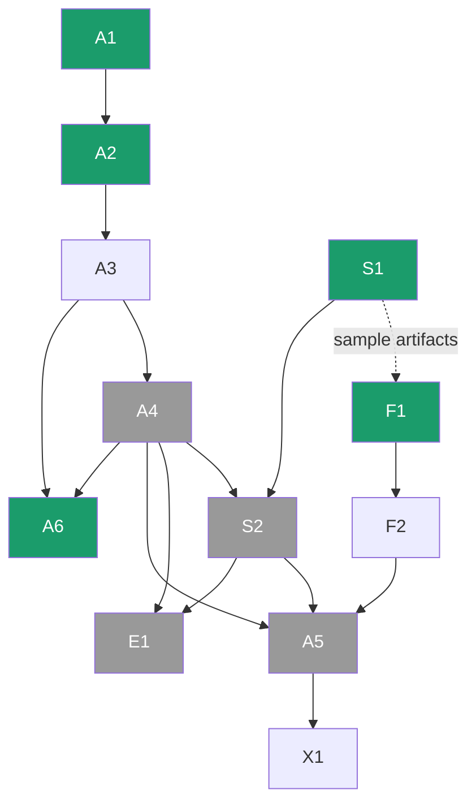

# Tracker.md — Project Backbone

> **This is the single source of truth for coordination.** Status, ownership, what to do next, and where to wait for others all live here. Humans update it as they work; **agents (Claude Code / Codex) read it first, work only within their assigned lane, and update it when done.**
>
> **Reading order for an agent:** §0 Identify yourself → §1 Operating Protocol → §2 Rules → your lane in §6 Task Board. Everything else is reference.

**Last updated:** 2026-06-24 · **Phase:** Build (P1 segmentation **A4 ✅ complete + released**; P2/P3 graph & resilience + dashboard F1/F2 landed; **A5 end-to-end integration next**) · **Overall:** 🟢 on track

---

## §0 · START HERE — Identify Yourself (the router)

**First action every session:** determine which team member you are working for. If the user hasn't said, ask: *"Which team member am I working as — Akshat, Shaivi, or Saanvi?"* Then read **only your lane**, respect the boundaries, and do not modify anything outside your ownership.

| If you are… | You own (edit freely) | Your job | Your next task | **Never touch** (warn instead) |
|---|---|---|---|---|
| **Akshat** | `src/pipeline/p1_segment/`, `notebooks/`, data-pipeline scripts, integration glue in `src/app/main wiring`, `requirements.txt`, `SETUP.md` | ML / segmentation, data pipeline, end-to-end integration, coordination | **A6** (dataset expansion / domain fine-tune) | Shaivi's `p2_graph/`, `p3_analysis/` internals · Saanvi's dashboard UI in `src/app/` (only touch the integration contract, with a heads-up) |
| **Shaivi** | `src/pipeline/p2_graph/`, `src/pipeline/p3_analysis/` | graph build + healing, criticality + resilience (classical Python, **CPU only**) | **S2** (waits on A4) | `p1_segment/` model code · `src/app/` dashboard UI · `notebooks/` training |
| **Saanvi** | `src/app/` (Streamlit dashboard), `docs/Design.md` | frontend / dashboard (**CPU only**, runs off `data/sample/`) | **F1** (S1 sample ready) → F2 | Any `src/pipeline/` code — you **consume** its artifacts, you don't edit it |

**Boundary rule for agents (enforce this):** if you are asked to change something outside your owner's lane, **stop and warn** using the templates in §1. Do the polite thing: flag it, don't silently do it.

---

## §1 · Agent Operating Protocol

**Before every reply (all roles — do this first, each turn, not just at session start):** check pull-request state on the remote so your view never drifts from what's actually merged. Run **both** `gh pr list --state open` **and** `gh pr list --state merged --limit 10` — the merged list is what catches PRs merged since last turn, so don't skip it. (`gh pr status` is fine as an *extra* convenience, but it does **not** list recently-merged PRs, so it never replaces the `--state merged` command.) Surface anything relevant: PRs **merged since last turn** (your local branch may be stale — offer to sync `dev`), **your own** open PRs' review/merge status, and **others'** PRs awaiting action. If a stacked PR's base was merged, re-target it (see §11). Don't assume a PR is still open just because it was last turn — verify.

**Also check reviews on every still-open (unmerged) PR — and address them.** For each open PR, pull its reviews and review comments (`gh pr view <n> --json reviews`, `gh api repos/{owner}/{repo}/pulls/<n>/comments`), bot or human. While a PR is unmerged, any review left on it is unresolved work: surface each comment and **act on it** — apply the fix and push (for PRs you own / in your lane), or, when working **as Akshat**, review+comment on teammates' PRs (per §11). Keep doing this each turn until the PR is merged; a merged PR needs no further review-chasing. (Ignore pure no-op bot notices, e.g. a private-repo upsell with no access.)

Then, every session, in order:
1. **Identify your owner** (§0). Load §2 rules + §4 contracts + your lane's tasks in §6.
2. **Pick the next task:** your owner's lowest-ID task that is `🔄` or `⏳ ready` and **not** `🔒 blocked`.
3. **If it's blocked,** find what it waits on (§6 "Waits on" column / §7), and tell the user — don't force it. Offer a ready alternative.
4. **Do the task inside your lane only.** Read inputs from the paths in §4; write outputs to the contracted paths. Keep code simple and readable (§2).
5. **Run the done-checks** in the task row (smoke test / sanity asserts / artifact matches contract).
6. **Update this file:** flip the task status, add a one-line §10 daily-log entry. Keep task IDs stable.
7. **If you must change a shared contract** (artifact format, a shared interface), STOP, warn the user, and update §4 explicitly — a silent contract change breaks someone else's work.

**Hard "never" list:** violate §2 rules · edit another owner's files · invent results/metrics/citations · commit secrets or raw/restricted data · switch the resilience metric · introduce a database/auth/REST/JS-SPA.

**Warning templates (use verbatim-ish):**
- *Out of lane:* "⚠️ That's **{Owner}'s** area (task **{ID}**, files `{path}`). I shouldn't modify it as **{You}**. Options: switch me to {Owner}, or I'll log this as a request for them in the Tracker."
- *Blocked / wait for someone:* "⏳ **{ID}** is blocked — it needs `{artifact}` from **{Owner}'s** task **{dep-ID}**, which isn't done yet. While we wait, I can do **{ready-ID}** instead. Want that?"
- *Contract change:* "🛑 Doing this changes a shared artifact contract (`{artifact}`) that **{Owner}** depends on. I've paused — confirm and I'll update §4 and ping {Owner}."

---

## §2 · Ground Rules (non-negotiable — from `Rules.md`)

- **Stack:** Streamlit + Folium, **pure Python**. ❌ no React/JS SPA · ❌ no database (file-based artifacts) · ❌ no REST API · ❌ no auth in v1.
- **ML:** **fine-tune pretrained models only** (no training from scratch). **PyTorch only** (not TensorFlow).
- **Resilience Index = global efficiency** ratio (finite when the graph disconnects). ❌ never raw average-path-length ratio.
- **Compute:** training is **hardware-agnostic via Colab/Kaggle** (or an optional local NVIDIA GPU); **graph + dashboard run on CPU**. No one remote-accesses anyone's machine.
- **Runnable by everyone:** committed `data/sample/` artifacts let the dashboard + analysis run with no GPU and no prior pipeline run.
- **Repo hygiene:** keep it **neutral/generic** (no private hardware specifics, no secrets); `.gitignore` raw data + checkpoints; respect dataset licenses (OSM ODbL, OpenSatMap non-commercial, Cartosat restricted).
- **Code:** simple and readable over clever; type hints + short docstrings; config not hardcoded.
- **Git (see §11 for full workflow):** branch off **`dev`** (never `main`) as `<you>/<task-id>-<slug>`; when the task's done-criteria are met, **open a PR into `dev` and stop** — do not merge on creation. **Akshat is the only approver.** Only `main`-related: **agents never PR or merge into `main`** (that's Akshat's stage-gate).

---

## §3 · Project Map (fast context)

**What:** extract roads from satellite imagery even where occluded → heal into a routable graph → find critical junctions + a resilience score → interactive dashboard. (Full: `PRD.md`.)

**Pipeline (phases hand off by file):**
`imagery + OSM → [P1 segment] → mask → [P2 skeletonize+heal] → graph → [P3 criticality+resilience] → metrics → [P4 dashboard]`

**Target repo layout** (create dirs that don't exist yet, in task A2):
```
data/raw/        (gitignored)      data/interim/      data/processed/
data/outputs/    data/sample/      (COMMITTED — lets dashboard run with no GPU)
models/          (gitignored)
src/pipeline/p1_segment/  p2_graph/  p3_analysis/
src/app/         (Streamlit dashboard)
notebooks/       (Colab/Kaggle training)
docs/            (the 11 docs)     requirements.txt   SETUP.md   CLAUDE.md   AGENTS.md
```

**Where to look (docs):** `PRD`=what/why · `TRD`=architecture/stack · `Schema`=data shapes · `UserJourney`=flows · `Design`=dashboard UI · `Implementation`=roadmap/milestones · `Rules`=standards · `Research`=literature + hardware verdict · `Evaluation`=metrics + experiments · `RiskRegister`=risks · **`Tracker` (this)**=status + coordination.

---

## §4 · Artifact Contracts (the interfaces — keep stable)

These files ARE the handoffs. If your input doesn't exist, you **wait for its producer** (§7).

| Producer (owner) | Artifact | Path | Schema / format | Consumer(s) |
|---|---|---|---|---|
| P1 (Akshat) | road mask | `data/interim/{aoi}_mask.png` | binary {0,1}, same size as input tile — produced from a trained checkpoint via `python -m src.pipeline.p1_segment.predict --image <tile> --checkpoint <pt> --aoi <id>` (tiles + stitches large images) | P2 |
| P2 (Shaivi) | healed graph | `data/processed/{aoi}_graph.graphml` (+ `.geojson`) | NetworkX graph; nodes have `x,y,betweenness,is_critical`; edges have `length_m>0,is_bridged` (see `Schema.md`) | P3, P4 |
| P3 (Shaivi) | criticality + resilience | `data/processed/{aoi}_criticality.csv` | per-node `node_id,betweenness,rank,is_critical`; resilience curve | P4 |
| Shaivi (early) | **sample set** | `data/sample/{aoi}_graph.geojson`, `_criticality.csv` | small, committed, real-shaped | **P4 dashboard runs out-of-the-box** |
| P4 (Saanvi) | dashboard | `src/app/app.py` | reads the above; in-process `simulate_ablation(graph, node)` | end user |

**Golden rule:** consume artifacts at these exact paths/shapes. Changing a shape is a §1 contract change.

---

## §5 · Ownership & Boundaries

**Owned outright (edit freely):** as in §0.
**Shared — coordinate before editing (warn the user, note in §10):** `requirements.txt`, `SETUP.md`, this `Tracker.md`, §4 contracts, any shared `config`.
**Read-only for consumers:** Saanvi reads pipeline artifacts but never edits pipeline code; P3 reads P2's graph but doesn't rewrite P2.

If two tasks would touch the same shared file, the later one waits or coordinates — don't both edit blindly.

---

## §6 · Task Board

`ID · status · task — owner — waits on → blocks · done-when`. **Status:** ✅ done · 🔄 in progress · ⏳ ready (do now) · 🔒 blocked.

> **Every task's "done" also includes:** open a PR into `dev` (per §11) and update this Tracker — a task isn't done until its PR is up and the status is flipped.

### Completed
| ID | Task | Owner |
|---|---|---|
| D0 ✅ | Repo + docs scaffolding (`Index.md`, CODEOWNERS) | Akshat |
| D1 ✅ | All 11 documentation files (Phases 1–4) | Akshat (Design: Saanvi) |

### Akshat — ML / data / integration
| ID | Status | Task | Waits on | Blocks | Done when |
|---|---|---|---|---|---|
| **A1** | ✅ | Environment + pinned `requirements.txt` + `SETUP.md` | — | A3, everyone's setup | core libs import on a clean env; `requirements.txt` + `SETUP.md` committed — verified on Akshat's Windows machine: `pip install -r requirements.txt` succeeds, `import streamlit, folium, networkx, skimage, sknw, rasterio, osmnx` → `CPU env OK` |
| **A2** | ✅ | Repo skeleton (`src/`, `data/`, `notebooks/`, `.gitignore`) | — | A3, F1, S1 outputs | dirs exist; `data/raw`+`models/` gitignored; `data/sample/` placeholder present — created `src/pipeline/{p1_segment,p2_graph,p3_analysis}`, `src/app`, `data/{raw,interim,processed,outputs,sample}`, `models/`, `notebooks/` with `.gitkeep`; `.gitignore` ignores `data/raw|interim|processed|outputs/*` + `models/*` (kept placeholders via `dir/*` + negated `.gitkeep`) |
| **A3** | ✅ | Data pipeline: download/cache + tiling + **OSM→mask** script | A1, A2 | A4 | produces aligned `{aoi}_mask`-style labels in `data/interim/`; QC'd on 1 tile — `src/pipeline/p1_segment/{osm_mask,build_dataset}.py`: osmnx→rasterio metric-grid masks, m-buffered roads, 256px tiling, GPKG cache, JSON alignment manifest; verified on Panaji (4310×3343 @1m/px, 5.65% road px, 238 tiles, strictly {0,1}); 9 offline unit tests pass |
| **A4** | ✅ | Fine-tune segmentation (SegFormer/U-Net) — Colab/Kaggle notebook | A3 | S2, A5, E1 | **COMPLETE.** Final model: **SegFormer MiT-B3 + SCSE U-Net (EMA), 47.5M params, 30 epochs**, DeepGlobe Roads. Full-res sliding-window+Hann validation → **flip+multi-scale TTA IoU 0.6699** (best single-view EMA 0.6638); occlusion-aware deploy **thr 0.44 → clean IoU 0.6617 / Occlusion-Recall 0.793** (selection written into checkpoint `meta`). Recipe: ComboLoss (BCE+Dice+Lovász+clDice ramp), road-aware crops, rich aug, discriminative LR, warmup+cosine. **Checkpoint released:** https://github.com/Akshat-Tiwari69/Trace/releases/tag/a4-roadseg-v1 (asset `deepglobe_mit_b3_scse_512px_best.pt`, ~190 MB; local `models/` gitignored). `load_checkpoint` rebuilds the SCSE arch from `meta`; `predict.py` / S2 `run_real_mask` deploy it unchanged (smoke-tested on the real file). P1→P2→P3 integration verified on the §4 contracts. 68 CPU unit tests pass. (Honest note vs the 0.672 Codex baseline: a statistical tie, ~0.002 behind on raw IoU; the gain is rigor + integration.) |
| **A5** | ✅ | Walking skeleton → end-to-end integration on 1 tile | A4 ✅, S2 ✅, F2 ✅ | X1 | **DONE.** `src/pipeline/run_pipeline.py` — one command runs P1 `predict` → P2 `build_graph` → P3 `analyze` → P4 contract check, no manual steps. Verified end-to-end on a real Panaji tile (100 nodes/77 edges, dashboard columns match) + deterministic orchestration test (`tests/test_run_pipeline.py`). |
| **A6** | ✅ | **Dataset expansion + domain fine-tune** (push seg past A4's 0.670) | A3 ✅ (OSM→mask tooling) · A4 ✅ (base checkpoint) → **ready / unblocked** | **nothing hard** — leaf enhancement; succeeding only *enables* (not gates) an optional refreshed E1 eval + a re-run of A5/S2 on the better model + a `a4-roadseg-v2` release | **Step 1 (data prep) ✅** — `build_finetune_data.py` (aligned Esri-satellite + OSM-mask DeepGlobe-format pairs; reuses A3's grid, warps imagery onto it; 4 offline tests; `data/finetune/` gitignored). **Step 2 (generate set) ✅** — **169 aligned pairs across 5 Indian cities** (Panaji, Margao, Mumbai-Bandra, Bengaluru-Indiranagar, Delhi-CP; 7–14% road coverage) in `data/finetune/`; alignment spot-checked on multiple cities (OSM roads trace the real streets in the warped imagery). **Step 3 (fine-tune harness) ✅** — `p1_segment/finetune.py` (CPU-smoke-tested): loads `a4-roadseg-v1` → mixes the oversampled Indian pairs with DeepGlobe (avoids forgetting) → short low-LR ComboLoss fine-tune → saves `v2` with provenance `meta`. Also **fixed the mask format** to true DeepGlobe 0/255 (was {0,1}, which readers threshold-out → would've trained on blank labels). **Step 4 — first v2 rejected:** full-model fine-tune (600-tile anchor) adapted to India (+0.13) but **forgot DeepGlobe (−0.07)** → not released, per the rule. **Step 5 ✅ RELEASED:** rebuilt `finetune.py` to **freeze the encoder** (decoder-only adaptation) + **2000-tile DeepGlobe anchor** + **select the epoch that maxes Indian IoU without regressing DeepGlobe**. Result (held-out, fresh-sample confirmed): **DeepGlobe neutral (−0.004, within noise) · Indian +0.018–0.032** → ≥ v1 everywhere. **Released `a4-roadseg-v2`:** https://github.com/Akshat-Tiwari69/Trace/releases/tag/a4-roadseg-v2 . Honest: the Indian metric is weak-OSM-label *agreement* (a domain-adaptation proxy, not ground truth); the bigger lever for real gains is self-training (**A12**). **Training needs a Kaggle/Colab GPU** (same as A4). Lane: Akshat. |
| **A7** | ✅ | **D4 TTA opt-in flag in `predict.py` / `run_pipeline.py`** | — | A5 re-run, E2 | **DONE** (dependency-free — reused flip/rotate averaging, no `ttach`). `--tta` flag on `predict.py` + `run_pipeline.py`; `predict_mask`/`predict_large` take `tta=`. 14 tests. **Measured on v1 (DeepGlobe tiles): no gain — single IoU 0.6816 vs D4-TTA 0.6795 (−0.002 @thr 0.44, within noise)**, as expected since this SegFormer already trains/vals with flip+multi-scale TTA and is orientation-robust. Per §Recommendations' rule (<0.5 IoU ⇒ keep only if runtime acceptable), **kept opt-in / off by default** (8× compute for ~0 gain here); flag stays available to re-measure on v2/A8/A9. *(detail: Research.md → Roadmap §A)* |
| **A8** | ⏳ | **Heavier occlusion-augmentation pass** | — | A11, E3 | Tunable occlusion stack (`CoarseDropout`+`GridDropout`+`RandomShadow`+colour) via config; retrain from `a4-roadseg-v1`. Done when Occlusion-Recall improves vs 0.793 at ≤0.01 IoU cost, numbers in `Evaluation.md`. |
| **A9** | ⏳ | **Promote soft-clDice to a first-class weighted loss term** | — | E3 | Make clDice α a config knob, start earlier (α≈0.3–0.4, iter_=3) not just the late ramp; reduce batch/patch for memory; retrain. Done when connectivity (clDice score / fragment count) beats the ramp-only baseline. |
| **A10** | ⏳ | **Mask post-processing module** | — | S3, E2 | New `p1_segment/postprocess.py`: morphological open/close, connected-component area filter, Otsu option, skeleton-spur pruning; called by `predict.py`. Done when tiny false components drop on a sample tile without IoU loss > 0.005. |
| **A11** | 🔒 | **Add SpaceNet-3 + Massachusetts Roads to the training mix** | A8 | A12 | DeepGlobe-format loaders for SpaceNet (0.3m) + Massachusetts (1m); multi-dataset fine-tune from v1. Done when a multi-source checkpoint is evaluated on a held-out split and recipe + numbers are in `Evaluation.md`. |
| **A12** | 🔒 | **Self-training / pseudo-labeling on unlabeled Indian tiles** | A6, A11 | A13 | Pseudo-label confident regions of unlabeled Indian basemap tiles (confidence + connectivity refinement), add to the fine-tune set, retrain. Done when Indian-val IoU beats A6's v2 (target ≥ +3pp). |
| **A13** | 🔒 | **Two-backbone ensemble at inference** | A7 | E2 | Average logits of MiT-B3+SCSE-Unet with a complementary CNN backbone (SE-ResNeXt50 / EfficientNet-b4 Unet) fine-tuned on the same data. Done when ensemble IoU/APLS beats the best single model on held-out (runtime noted). |
| **A14** | ⏳ | **Try a larger encoder (MiT-B4/B5, compute permitting)** | — | — | Fine-tune one larger SegFormer variant via smp; compare vs B3 on the same split. Done when B4/B5 vs B3 IoU/APLS + train-time tradeoff is recorded; keep the winner as a candidate. |
| **A15** | ⏳ | **Connectivity-aware decoder experiment (D-LinkNet / strip-conv)** | — | — | Prototype one connectivity-oriented arch (D-LinkNet dilated centre, or a strip-conv module) and compare APLS/clDice vs MiT-B3. CoANet code is non-commercial. Done when the comparison is logged; adopt only if it wins on topology metrics. |

### Shaivi — graph + resilience (CPU, no GPU)
| ID | Status | Task | Waits on | Blocks | Done when |
|---|---|---|---|---|---|
| **S1** | ✅ | Graph/resilience spike on an **OSM graph** | — (starts now) | F1 (sample), S2 | osmnx→skeleton→sknw→**MST/Union-Find healing**→betweenness→ablation→**global-efficiency RI** run end-to-end; exports `data/sample/{aoi}_graph.geojson` + `_criticality.csv` — **implemented + verified** (`src/pipeline/p2_graph/{skeleton_graph,healing,graph_io,build_graph,spike_osm}.py`, `p3_analysis/{criticality,resilience,analyze}.py`): angle-aware MST/Union-Find healing, weighted global-efficiency RI; spike on Panaji w/ simulated occlusion → 30→8 components (+22 bridges), targeted RI 0.642 < random 0.703; sample emitted; 15 unit tests green. **Merged (PR #10).** |
| **S2** | ✅ | Run healing + criticality on **real predicted masks** | A4 (mask) ✅ | A5, E1 | same pipeline consumes P1 mask → `data/processed/` graph + criticality. Consume-path `p2_graph/run_real_mask.py` (+ `tests/test_s2_real_mask.py`). **Real-mask run done** (Akshat ran P1 `predict.py` on a live ESRI World-Imagery Panaji tile → `run_real_mask`): **100 nodes / 77 edges, 38→23 components (+15 bridges, +50% connectivity), top node 49, targeted RI 0.503 < random 0.780** ✓. Pixel-space (predict.py drops geo-transform); a georeferenced on-map dashboard demo still needs the tile's manifest to ride along — open P1↔dashboard handoff. |
| **S3** | ⏳ | **Graph simplification: prune stubs + collapse degree-2 chains** | A10 (cleaner mask helps) | S5 | Remove short dead-end spurs + merge degree-2 interstitial nodes (keep geometry), OSMnx-style. Done when node/edge count drops on the sample with connectivity ratio preserved; unit tests added. *(detail: Research.md → Roadmap §B)* |
| **S4** | ⏳ | **Near-duplicate node consolidation** | — | S5 | Merge node clusters within a metric tolerance into one junction (mirror `consolidate_intersections`; guard against merging overpasses, Boeing 2025). Done when spurious junctions drop, verified on sample + test. |
| **S5** | 🔒 | **Polyline simplification (Douglas-Peucker)** | S3, S4 | F3 | shapely `simplify` on edge geometry with a tolerance config. Done when vertex count drops materially with shape preserved (Hausdorff check) — lighter GeoJSON for the dashboard. |
| **S6** | ⏳ | **Smarter gap-healing: spline bridges + better angular scoring** | — | — | Tune `healing.py` Euclidean+angle weights; draw bridged links as smooth curves not straight segments. Done when bridges look natural on sample and connectivity gain ≥ current (+50%), tests updated. |
| **S7** | ⏳ | **APLS + topology validation against OSM** | — | E4 | Port CosmiQ `apls` + connectivity ratio comparing the healed graph to OSM ground truth. Done when APLS is reported for the sample graph in `Evaluation.md` and re-runnable via a CLI. |
| **S8** | ⏳ | **Articulation points & bridges as a criticality layer** | — | F4 | Add `nx.articulation_points` + `nx.bridges` to `criticality.py`; emit `is_articulation` / `is_bridge`. Done when these columns are emitted and validated on sample (known cut node detected), tests added. |
| **S9** | ⏳ | **Approximate k-sample betweenness + caching for large graphs** | — | — | Expose `betweenness_centrality(k=...)` with cached results; benchmark vs exact. Done when k-sample runs ≥ 5× faster on a large graph with rank correlation ≥ 0.9 vs exact, documented. |
| **S10** | ⏳ | **Demand/population-weighted & percolation centrality** | — | — | Optional population/demand weight or `nx.percolation_centrality` so criticality reflects usage, not just topology. Done when weighted criticality is produced and compared to plain betweenness on sample. |
| **S11** | ⏳ | **Flood / elevation-based failure scenario + comparison** | — | F5, E4 | Disable nodes below an elevation / inside a flood polygon and recompute the global-efficiency RI curve; compare targeted vs random vs flood. Done when a flood RI curve is written to `data/processed/`, re-runnable, tested. |

### Saanvi — dashboard (CPU, off `data/sample/`)
| ID | Status | Task | Waits on | Blocks | Done when |
|---|---|---|---|---|---|
| **F1** | ✅ | Dashboard env + scaffold on sample artifacts | uses S1 sample (mock OK until then) | F2 | Streamlit+folium app loads `data/sample/`, renders roads coloured by criticality + legend; map ~65% / panel ~35% per `Design.md` |
| **F2** | ✅ | Full dashboard: click-to-disable sim + rerouting + travel-time + charts | F1 | A5 | clicking a node disables it, reroutes, shows RI drop + travel-time %, updates instantly |
| **F3** | ⏳ | **Large-graph performance: caching + geometry simplification + clustering** | S5 (lighter geojson) | — | `st.cache_data`/`st.cache_resource` for artifact + graph loading; render simplified polylines; FastMarkerCluster for nodes; trim `st_folium` returns. Done when a large sample renders noticeably faster (timed before/after) with no functional regression. *(detail: Research.md → Roadmap §D)* |
| **F4** | ⏳ | **Surface articulation points / bridges in the UI** | S8 | — | Read the new criticality columns; add a layer/legend highlighting single-points-of-failure. Done when articulation nodes/bridges are visually distinct with tooltips, off the sample data. |
| **F5** | ⏳ | **Draw-a-flood-polygon → multi-node failure simulation** | S11 | — | Folium Draw plugin; disable all nodes inside the drawn polygon; recompute RI + reroute. Done when drawing a polygon disables the enclosed nodes and updates RI/charts live. |
| **F6** | ⏳ | **Before/after comparison + resilience-curve side chart** | — | — | Side-by-side/toggle of baseline vs post-failure network + a resilience-degradation curve chart. Done when both views render and the curve matches P3 numbers. |
| **F7** | ⏳ | **Export / report: download GeoJSON + summary PDF/PNG** | — | — | Download buttons for the current graph (GeoJSON) + a one-page summary (criticality table + RI). Done when downloads work from the running app. |
| **F8** | ⏳ | **Polish: loading states, error handling, colorblind-safe legend** | — | — | Spinners, graceful errors for missing artifacts, colorblind-safe ramp + legend. Done when the app degrades gracefully with no artifacts and passes a colorblind check. |

### Shared / final
| ID | Status | Task | Owner | Waits on |
|---|---|---|---|---|
| **E1** | ✅ | Evaluation suite + ablations (`Evaluation.md`) | Akshat (seg) · Shaivi (graph) | A4, S2 — **both lanes packaged.** Graph: `p3_analysis/evaluate.py` (connectivity, criticality, targeted-vs-random resilience). Seg: `p1_segment/evaluate.py` reads the A4 checkpoint meta → **IoU 0.670 (flip+scale TTA) / Occlusion-Recall 0.793 @thr 0.44** → `data/sample/segmentation_eval.json` + Evaluation.md seg subsection. Headline numbers + reproducible scripts done; the on/off **ablation** runs (occlusion, clDice — need GPU re-trains) remain optional future evidence. |
| **E2** | ⏳ | Connectivity/topology metric suite (relaxed IoU + APLS + connectivity ratio) | Akshat (seg) · Shaivi (graph) | A7, A10, S7 — done when buffered/relaxed IoU + APLS + connectivity ratio report for the released model + sample graph in `Evaluation.md`. *(detail: Research.md → Roadmap §E)* |
| **E3** | ⏳ | Ablation studies: clDice on/off, occlusion-aug on/off | Akshat | A8, A9 — done when a with/without ablation table (IoU/Occ-Recall/clDice) proving each component helps is in `Evaluation.md` |
| **E4** | ⏳ | Resilience ablations: healing on/off, targeted vs random vs flood | Shaivi | S7, S11 — done when the ablation table (targeted > flood > random damage) is in `Evaluation.md` |
| **E5** | ⏳ | Experiment tracking + config files | Akshat (lead) · all | — done when YAML configs (no hardcoded params) + CSV/W&B logging + fixed seeds make ≥1 training and ≥1 analysis run reproducible from a committed config |
| **X1** | ⏳ | Backup demo screen-capture | All | A5 |

### Bugs / Issues
| ID | Type | Description | Owner | Status |
|---|---|---|---|---|
| I-1 | issue | GDAL/rasterio installs differ per machine — solve in A1, document the fix in `SETUP.md` | Akshat | ✅ resolved: pip wheels install rasterio/fiona/geopandas directly on Windows (no conda/GDAL build) — confirmed independently by A1 (Akshat) and S1 (Shaivi); `SETUP.md` Path A + Troubleshooting now make conda an optional fallback |
| I-2 | issue | DeprecationWarnings from torch.jit.script / torch.jit.interface during tests (18) | Akshat | ✅ triaged: **upstream, not our code** — `timm` (transitive dep of smp) calls `torch.jit.script` at import (`timm/layers/activations_jit.py`). Silenced via scoped `pytest.ini` `filterwarnings`; clears when smp/timm migrate to torch.compile |
---

## §7 · Coordination & Wait-Points (where to wait for whom)



**Plain-English wait list:**
- **Saanvi (F1/F2)** can start **now** on mock data, then swap to **Shaivi's S1 sample artifacts** when ready. She **waits on Shaivi** only for *real-shaped* data, never to begin.
- **Shaivi's S2** waits on **Akshat's A4** (the predicted mask). Until then she works **S1** (OSM graph) — never idle.
- **Akshat's A4** waits on **A3** (data pipeline), which waits on **A1/A2**.
- **A5 integration** waits on **A4 + S2 + F2** (all three lanes converge). It's the last big step.
- **E1 evaluation** waits on **A4 + S2**.

**Nobody is ever blocked at the start:** A1/A2 (Akshat), S1 (Shaivi), F1 (Saanvi) are all 🔄 ready in parallel.

---

## §8 · Decisions Log (locked — don't re-litigate)

| Decision | Rationale | Status |
|---|---|---|
| Resilience Index = **global efficiency** | raw avg-path-length → ∞ when graph disconnects | 🔒 locked |
| Frontend = **Streamlit + Folium** (pure Python) | team skill + CPU-friendly + fast to build | 🔒 locked |
| **File-based** artifacts, no DB/auth/REST in v1 | single-machine, read-mostly; DB adds no value | 🔒 locked |
| Segmentation = **fine-tune pretrained** only | fits compute budget; no time to train from scratch | 🔒 locked |
| Training **hardware-agnostic** (Colab/Kaggle); **no remote access** | everyone runs the same; each sets up their own machine | 🔒 locked |
| Repo kept **neutral/generic** | public-safe; no hackathon/hardware identity | 🔒 locked |

---

## §9 · Status Snapshot

- **Docs:** ✅ 11/11 complete. **Build:** in progress.
- **Done:** A1–A3 ✅ · S1 ✅ (P2 graph + healing, P3 criticality + global-efficiency resilience) · **A4 ✅ COMPLETE** (DeepGlobe road seg — **MiT-B3 + SCSE U-Net, EMA**: flip+scale-TTA IoU **0.670**, deploy thr 0.44 → IoU 0.662 / Occ-Recall 0.793; released **`a4-roadseg-v1`**) · F1 ✅ + F2 ✅ (#19/#20) · S1 follow-ups ✅ (#24) · **S2 ✅** (consume-path #25 + real-mask run on a live Panaji tile: 100 nodes/77 edges, 38→23 components, targeted RI 0.503 < random 0.780) · **E1 ✅** (graph #27 + seg `p1_segment/evaluate.py`: IoU 0.670 / Occ-Recall 0.793 → `segmentation_eval.json`) · **A5 ✅** (`run_pipeline.py` — one command P1→P2→P3→P4, verified on a real tile).
- **Pipeline backbone closed end-to-end (A1–A5 ✅).** Remaining: optional polish + the parked dataset research.
- **A6 ✅** — `a4-roadseg-v2` released (domain-adapted to Indian roads, DeepGlobe-neutral). **A7 ✅** (D4 TTA opt-in, measured no-gain). **Next task (Akshat): A8/A9** — occlusion-aug + first-class clDice (GPU retrains, now runnable locally on the 3070 Ti); then A11/A12 for bigger dataset/self-training gains.
- **Open handoff:** pixel-space↔georeferenced (a real *on-map* dashboard demo needs the tile's geo-transform/manifest to ride with the mask).

---

## §10 · Daily Logs

> Copy the block each working day. Newest on top.

**2026-06-25 (Akshat — A6 ✅ a4-roadseg-v2 released)**
- Done: **A6 complete — `a4-roadseg-v2` released.** After the first v2 forgot DeepGlobe (−0.07), rebuilt `finetune.py` with an **anti-forgetting recipe**: freeze the encoder (adapt decoder only), 2000-tile clean DeepGlobe anchor, and a **dual-domain selection** that only saves an epoch which keeps DeepGlobe while maxing Indian. Local 3070 Ti run (12 ep, encoder frozen) → **epoch 9 selected: DeepGlobe 0.6549→0.6510 (−0.004, within noise) · Indian 0.3008→0.3329 (+0.032)**; confirmed on a fresh 50+50 sample (DeepGlobe −0.004 · Indian +0.018). v2 is ≥ v1 everywhere → released: https://github.com/Akshat-Tiwari69/Trace/releases/tag/a4-roadseg-v2 .
- Honest framing: the gain is modest and against weak OSM labels; the recipe is now the reusable, principled domain-adapt path. Bigger gains need better labels → **A12 (self-training)**.
- Next: A8 (occlusion aug) / A9 (clDice) — GPU retrains, now runnable locally on the 3070 Ti.

**2026-06-25 (Akshat — v2 fine-tune evaluated, NOT released)**
- Done: ran the **local v2 fine-tune** to completion on the 3070 Ti (Indian val IoU climbed 0.30→0.33 over 5 ep). Same-protocol **v1-vs-v2 eval** on held-out sets: **DeepGlobe 0.592→0.521 (−0.071, forgot)** · **Indian 0.329→0.458 (+0.129, adapted)**. Domain fine-tuning clearly *works* (+0.13 on the deploy domain), but the small 600-tile DeepGlobe anchor let it regress the benchmark. **Decision: do NOT release this v2** (must not regress DeepGlobe per the rule).
- Caveat: the Indian "IoU" is *agreement with weak OSM labels* (wider than real roads), so +0.13 is a domain-adaptation proxy, not ground-truth accuracy.
- Next: retune A6 — bigger DeepGlobe anchor (~1500–2000) + fewer epochs / lower LR → keep DeepGlobe *and* gain Indian. Re-runnable locally (~1–2 hr). Then A8/A9.

**2026-06-25 (Akshat — A7 D4 TTA + local GPU enabled)**
- Done: **local GPU enabled** — CUDA torch 2.12.1+cu126 in `.venv-gpu` (all on F:, off the full C:); verified on the RTX 3070 Ti (`finetune.py` GPU smoke: 2.6 GiB peak — huge headroom). Launched the **real v2 fine-tune locally** (v1 + 169 Indian ×4 + 600 DeepGlobe anchor, 5 ep, lr 4e-5) — running in background; eval + release decision to follow.
- Done: **A7 ✅** — `--tta` D4 test-time-augmentation flag wired into `predict_mask`/`predict_large`/`predict.py`/`run_pipeline.py` (dependency-free flip/rotate averaging). **Honest measurement:** on v1 over DeepGlobe tiles, D4-TTA gave **−0.002 IoU (no gain)** — this SegFormer already trains/vals with flip+multi-scale TTA + is orientation-robust. Kept opt-in/off-by-default per the roadmap's own <0.5-IoU rule. +14 tests. Good example of validating an "indicative" roadmap number rather than assuming it.
- Next: when the v2 fine-tune lands → eval v1-vs-v2 on held-out DeepGlobe + Indian → release v2 only if it wins; then A8 (occlusion aug) / A9 (clDice) — now runnable locally on the 3070 Ti.

**2026-06-25 (Akshat — A6 fine-tune harness + mask-format fix)**
- Done: **A6 step 3 (fine-tune harness)** — `src/pipeline/p1_segment/finetune.py`: starts from `a4-roadseg-v1`, mixes the oversampled Indian pairs with DeepGlobe to avoid forgetting, short low-LR (~4e-5) ComboLoss fine-tune, saves `v2` with provenance meta. Reuses the existing `RoadTileDataset`/aug + `ComboLoss` + `train.train_one_epoch`/`evaluate`. CPU-smoke-tested (+2 tests; 82 total green). This is everything except the GPU run — **only Akshat's Kaggle/Colab fine-tune + my eval/release remain.**
- Fixed: **A6 mask format bug** — `build_finetune_data` saved masks as {0,1} but DeepGlobe readers threshold at >127, so the labels would've read as blank. Now saved as true 0/255; converted the existing 169 local pairs in place.
- Next: Akshat runs `finetune.py` on GPU → I run `evaluate.py` + release `v2` if it wins. Then the free CPU quick wins A7 (TTA) → A8 → A9.

**2026-06-25 (Akshat — v2 improvement roadmap added)**
- Added **30 new tasks** to §6 from the research roadmap (completed tasks left untouched per the "tasks are immutable" rule): **A7–A15** (seg — TTA, occlusion aug, first-class clDice, post-proc, datasets, self-training, ensemble, bigger encoder, connectivity decoder), **S3–S11** (graph cleaning + APLS + resilience depth), **F3–F8** (dashboard perf + flood polygon + export + polish), **E2–E5** (topology metric suite, ablations, experiment tracking). Each carries its waits-on/blocks. The citation-heavy **technique detail + sources + recommendations + caveats** went to `Research.md → v1 → v2 Improvement Roadmap` (kept out of the Tracker so it stays a board, not a lit review).
- Key framing: the model has plateaued on DeepGlobe (~0.670 ≈ the 0.6466 D-LinkNet baseline); the real wins are **topology metrics** (clDice/APLS) + **domain fine-tune** (A6) + free inference gains (TTA), not more DeepGlobe epochs.
- Next (recommended first): A7 (TTA) · A8 (occlusion aug) · A9 (clDice weight) · S3/S4 (graph cleaning) · F3 (dashboard caching) — all free/CPU/no-new-data; plus finishing A6's GPU fine-tune.

**2026-06-24 (Akshat — A6 step 2: fine-tune set built)**
- Done: ran `build_finetune_data.py` across 5 Indian-city patches → **169 aligned (satellite, OSM-mask) pairs** in `data/finetune/` (Panaji 30+22, Margao 30, Mumbai-Bandra 26, Bengaluru-Indiranagar 32, Delhi-CP 29; road coverage 7–14%, UTM grids EPSG:32643). **Alignment verified** by overlaying OSM masks on the warped Esri imagery on Panaji + Delhi + Bengaluru — green roads trace the real streets, confirming the warp-onto-mask-grid is correct end-to-end. Weak OSM labels → fine-tune use w/ buffered metrics. **A6 step 2 ✅.**
- Next: **GPU fine-tune** from `a4-roadseg-v1` on `data/finetune/` (Kaggle/Colab — Akshat), then `evaluate.py` → release `a4-roadseg-v2` if it beats 0.670 IoU / 0.793 Occ-Recall.

**2026-06-24 (Akshat — v1 shipped + A6 data-prep started)**
- Done: **v1 → `main`** (PR #32, 63 commits) + tagged **`v1.0`**; added a v1 **README** (pitch, pipeline, results, quickstart). Full backbone A1–A5 ✅, E1 ✅, model released, 76→80 tests green.
- Done: **A6 step 1 (data prep)** — `src/pipeline/p1_segment/build_finetune_data.py` builds aligned **(satellite, OSM-mask) DeepGlobe-format pairs** for fine-tuning: reuses A3's `build_aoi_masks` grid + manifest, fetches keyless Esri World-Imagery, **warps it onto the mask grid** (pixels align), tiles both, keeps road-bearing tiles → `data/finetune/` (gitignored). Default Indian-city AOIs baked in. +4 offline tests (tile math + identity warp via an injectable fetcher). **A6 → 🔄.**
- Next: run the generator (network) to produce the fine-tune set, then the Kaggle/Colab GPU fine-tune from the A4 checkpoint, then eval + (if it wins) release `a4-roadseg-v2`.

**2026-06-24 (Akshat — A6 task created)**
- New task **A6** (dataset expansion + domain fine-tune) added to §6/§7. Dependency analysis: **blocked by** A3 ✅ + A4 ✅ (both done → ready/unblocked); **blocks** nothing hard — it's a leaf enhancement whose better checkpoint would only *enable* an optional refreshed E1/A5/S2 re-run + a v2 release, not gate them. Goal: beat A4's 0.670 IoU / 0.793 Occ-Recall via staged fine-tune on Indian OSM tiles (+ optional SpaceNet-3). Needs a GPU run (Akshat). Recommendation lives in the A6 row.

**2026-06-24 (Akshat — A5 walking skeleton)**
- Done: **A5 ✅** — `src/pipeline/run_pipeline.py` chains the whole pipeline in one command: imagery + checkpoint → P1 `predict` → P2 `build_graph` → P3 `analyze` → P4 dashboard-contract check, **no manual steps**. Each stage is the teammates' code unchanged; the CLI is the integration glue. Verified **end-to-end on a real Panaji tile** (P1 5.13% road px → 100 nodes/77 edges → criticality + resilience → P4 columns match) and with a deterministic orchestration test that injects a synthetic-mask segmenter so P2→P3→P4 is tested without the 190 MB checkpoint (`tests/test_run_pipeline.py`). Pipeline backbone is now closed end-to-end.
- Next: (parked, per Akshat) research additional training datasets (SpaceNet / OpenSatMap / OSM-India) to push seg accuracy beyond 0.670.

**2026-06-24 (Akshat — E1 seg side + S2 real-mask test)**
- Done: **S2 real-mask run** (Shaivi's code, Akshat-tested — she's not set up for imagery). Pulled a live **ESRI World-Imagery** tile of tree-canopy Panaji (keyless XYZ stitch, no Kaggle needed), ran P1 `predict.py` with the released `a4-roadseg-v1` checkpoint → mask (5.13% road px) → `run_real_mask`: **100 nodes / 77 edges, components 38→23 (+15 bridges, +50% connectivity), top node 49, targeted RI 0.503 < random 0.780** ✓. Proves the full P1→P2→P3 chain on genuine model output; thesis holds on real, occluded imagery. S2 → ✅.
- Done: **E1 seg side** — `src/pipeline/p1_segment/evaluate.py` packages the A4 validation metrics from the checkpoint `meta` → committed `data/sample/segmentation_eval.json` + Evaluation.md seg subsection (IoU **0.6699** flip+scale TTA, Occlusion-Recall **0.793** @thr 0.44). `--image` adds a live qualitative inference demo + overlay. +3 tests. E1 → ✅ (both lanes packaged; on/off ablations remain optional, need GPU re-trains).
- Note (honest): the S2 numbers are on an **off-DeepGlobe, heavily-occluded** tile → a sparse/hard graph; reported as such in Evaluation.md, not oversold. Predicted masks are pixel-space — a georeferenced on-map demo still needs the geo-transform handoff.
- Next: **A5** walking skeleton (one command P1→P2→P3→P4 on one tile); then research extra training datasets to push seg past 0.670.


- Done: built `p3_analysis/evaluate.py` (+ `graph_io.load_geojson_graph`) — the **graph-lane evaluation** Akshat asked for. Reads the committed sample graph and reports: **connectivity ratio +15.1%** (largest CC 524→603, components 29→10 after healing), top "Gatekeeper" node betweenness **0.511**, and the resilience sanity check — **targeted ablation mean RI 0.674 vs random 0.860** over 40 removals (targeted hurts far more ⇒ betweenness finds real chokepoints). Writes `data/sample/panaji_demo_graph_eval.json` + `_resilience_curve.png`; numbers filled into `Evaluation.md`. +3 tests (39/39 green).
- Note: numbers are on the S1 OSM stand-in; the same `evaluate` runs unchanged on the real S2 predicted-mask graph once a tile is available.
- Next: hand numbers to Akshat for the eval report; E1 seg side is his.

**2026-06-24 (cont. 4 — Akshat: A4 COMPLETE + all PRs merged + integration verified)**
- **A4 ✅ COMPLETE.** Final Kaggle GPU run (30 epochs): **SegFormer MiT-B3 + SCSE U-Net, EMA weights** — full-res sliding-window+Hann val → **flip+multi-scale TTA IoU 0.6699** (best single-view EMA 0.6638); occlusion-aware deploy **thr 0.44 → clean IoU 0.6617 / Occlusion-Recall 0.793**, written into the checkpoint `meta`. EMA-lag made early epochs read ~0.05, unstick at e4 (0.379), climb to plateau (e16 0.642 → e24 0.659 → e30 0.664). Honest vs the 0.672 Codex baseline: a **statistical tie, ~0.002 behind** on raw IoU — the real gain is engineering rigor (every component CPU-verified pre-ship) + full pipeline integration, not the leaderboard number.
- **Checkpoint distributed via GitHub Release** (chosen over a Kaggle Dataset, so teammates stay on GitHub): https://github.com/Akshat-Tiwari69/Trace/releases/tag/a4-roadseg-v1 — asset `deepglobe_mit_b3_scse_512px_best.pt` (~190 MB, EMA, meta-driven). `load_checkpoint` **smoke-tested on the real file**: rebuilds the SCSE U-Net from `meta` and runs `predict_mask`. Local `models/` stays gitignored (release assets live outside the git tree, so the gitignore-checkpoints rule holds).
- **All four open PRs reviewed + merged to `dev`:** #19 F1 + #20 F2 (Saanvi dashboard), #24 S1 follow-ups + #25 S2 consume-path (Shaivi). Recovered #20 after a stacked-branch auto-close; resolved the #24/#25 Tracker daily-log conflicts as a union. **68 CPU unit tests green on integrated `dev`.**
- **Integration verified end-to-end:** P1→P2→P3→(P4 inputs) line up on the §4 contracts — `predict_large` mask → `build_graph` heal → `analyze` → criticality.csv schema matches the dashboard contract; resilience sanity held (targeted RI 0.000 < random 0.364).
- Next: **A5** walking skeleton — now fully unblocked (A4 ✅ + S2 path ✅ + F2 ✅). Shaivi can pull the release → `predict.py` on a real tile → `run_real_mask` for S2's real numbers; coordinate the pixel-space/geo-transform (manifest) handoff she flagged.

**2026-06-24 (Shaivi — S1 review follow-ups)**
- Done: addressed the second-pass Copilot review on the (now-merged) S1 PR #10, in branch `shaivi/S1-review-followups`:
  - `spike_osm.simulate_occlusion` — fixed off-by-one so a patch is exactly `patch_px×patch_px` (was `2·half`); regenerated `data/sample/` (29→10 components, +19 bridges, +15.1% connectivity; targeted RI 0.638 < random 0.816).
  - `resilience.global_efficiency` — added optional `k`-sample source estimation (forwarded through `resilience_index`/`ablation_curve` + new `analyze --efficiency-k`) so the O(N·E log V) all-pairs recompute can't hang on very large AOIs (TRD perf / RiskRegister T-3). Default stays exact, so artifacts don't drift.
  - `test_resilience` — compute betweenness once in `test_largest_cc_fraction_reported`.
  - Tests: +3 (occlusion exact-size, zero-patch copy, efficiency k-sample); P2/P3 suite 23/23 green.
- Next: S2 — now unblocked (A4 landed, P1 `predict.py` produces the mask artifact); run the same `build_graph`/`analyze` on a real predicted mask → `data/processed/`.

**2026-06-24 (Shaivi — S2 started)**
- Done: built the **S2 consume-path** in branch `shaivi/S2-real-mask`. `p2_graph/run_real_mask.py` runs the *same* `build_graph` → `analyze` engine on a real predicted mask (`data/interim/{aoi}_mask.png` from `predict.py`), writing to `data/processed/` (not the committed sample set). Smoke-tested offline on a synthetic pixel-space predicted-style mask (`tests/test_s2_real_mask.py`): heals the punched gap and emits criticality. P2/P3+S2 suite 31/31 green.
- Open question (coordinate w/ Akshat): `predict.py` reads RGB via OpenCV and **drops the geo-transform**, so predicted masks are **pixel-space** — fine for S2's graph/criticality numbers, but the on-map dashboard demo needs the tile's geo-transform to ride along (a manifest beside the mask). Not faking it; flagging the handoff.
- Blockers / waiting on: a **real predicted-mask artifact** — the trained checkpoint + a tile (then `predict.py` → my pipeline), or a committed predicted mask from A4. The code is ready; only the real input is missing for final numbers.
- Next: obtain a real predicted mask, run `run_real_mask`, record numbers, then PR S2 into `dev`.

**2026-06-23 (Saanvi, F2)**
- Done: **F2 ✅** — added map-click junction selection, node-ablation simulation using the locked global-efficiency RI, exact same-speed route-length impact, orange rerouting, red disabled states, reset/layer/scenario controls, and live travel-impact/delay-contributor charts per `Design.md`.
- Verified: top-ranked junction 45 updates RI 1.000→0.976 and representative route 161 m→449 m (+178.6%); top-five critical-node sweep handles finite detours and route cuts; browser closure/reset flows pass with no console errors; 55 tests pass.
- PR: F2 is stacked on the open F1 PR branch; request Akshat's review, then retarget F2 to `dev` when F1 merges.

**2026-06-23 (Saanvi)**
- Done: **F1 ✅** — rebuilt the Streamlit + Folium dashboard on the committed S1 sample artifacts. The 65/35 layout renders 760 roads by endpoint criticality with a Viridis legend, labels 64 critical junctions, and distinguishes healed links with dashed lines.
- Verified: installed `requirements.txt` globally under Python 3.12 (no virtual environment); imports pass; Streamlit health check passes; browser render shows 637 junctions / 760 road links with no console errors.
- Next: open the F1 PR into `dev`, then F2 after Akshat reviews/merges it.
**2026-06-24 (cont. 2)**
- Done: **A4 notebook rebuilt for max accuracy** — `notebooks/train_segmentation.ipynb` now uses **SegFormer mit_b3 + SCSE-attention U-Net**, **EMA** weights (evaluated + exported), **ComboLoss = BCE + Dice + Lovász-hinge + soft-clDice (ramped)**, richer augmentation (ShiftScaleRotate/blur/noise/CLAHE), and **flip + multi-scale TTA**, on top of the prior sliding-window/Hann val + occlusion-aware threshold infra. Extended the P1 API to support it: `build_model(arch, decoder_attention_type)`, `losses.ComboLoss`/`lovasz_hinge`, and `load_checkpoint` now reads `arch`/`decoder_attention_type` from `meta` (+`weights_only=False`) so the SCSE checkpoint reloads cleanly. **Verified which decoders actually build with the MiT encoder** (Unet/MAnet/FPN yes; UnetPlusPlus/DeepLabV3+ no) and CPU-dry-ran every notebook function (TTA, EMA, ComboLoss, occlusion selection). 62 unit tests pass. **Honest note: not GPU-benchmarked — expected to beat 0.672, but the real number needs Akshat's Kaggle run.**

**2026-06-24 (cont.)**
- Done: **A4 occlusion-aware deploy threshold** — cell 9 now sweeps the threshold and picks the one that maximises Occlusion-Recall while staying within 0.01 IoU of the peak. Result: deploy **thr 0.24 → IoU 0.663 / Occlusion-Recall 0.805** (vs peak IoU 0.672 @ thr 0.48 with Occ-Recall 0.752). Recovers the occlusion-robustness story for only −0.009 IoU; the chosen threshold is written into the checkpoint `meta`, so `predict.py` deploys at 0.24 automatically.

**2026-06-24**
- Done: **A4 accuracy upgrade** — replaced `notebooks/train_segmentation.ipynb` with a Kaggle-optimized **mit_b3 @512px** recipe (road-aware crop sampling, full-resolution sliding-window + Hann-blended validation, flip-TTA, discriminative LR, gradient accumulation, warmup+cosine, topology loss in the last 5 epochs, coverage-stratified split). Best **full-res flip-TTA val IoU 0.672 · Dice 0.804 · threshold 0.48 · Occlusion-Recall 0.752** — up from the 0.547 centre-crop baseline, and at/above typical DeepGlobe published IoU. Uses the existing P1 API (`build_model`/`DiceBCELoss`/`occlusion_recall`); checkpoint meta carries `encoder`+`threshold` so `predict.py` loads it unchanged.
- Caveat: occlusion-recall reads lower (0.752 vs 0.90 earlier) — different eval protocol (512px/sliding-window) + lighter occlusion aug; bump `occlusion_probability` if robustness is prioritised over raw IoU.
- Next: save the mit_b3 checkpoint as a Kaggle Dataset for Shaivi (S2) + A5 reuse.

**2026-06-23 (cont. 2)**
- Done: **P1 inference CLI** (`src/pipeline/p1_segment/predict.py` + `predict_large` in `model.py`) — turns imagery + a trained checkpoint into the §4 contract artifact `data/interim/{aoi}_mask.png` by tiling/stitching (reuses A3's `tile_array`). This is the bridge from A4's model to S2's graph build. 55 tests pass (added `predict_large` coverage). Verified end-to-end on a dummy checkpoint.
- Next: once a real checkpoint is downloaded, run the CLI on a sample tile to emit a real mask for Shaivi's S2.

**2026-06-23 (cont.)**
- Done: **A4 ✅** — fine-tuned SegFormer mit_b0+U-Net on DeepGlobe via Kaggle (T4, 15 epochs, DiceBCE, CoarseDropout occlusion aug, cosine LR): **val IoU 0.547 · Dice 0.703 · Occlusion-Recall 0.897**. Checkpoint saved off-device.
- Debugging the run surfaced + fixed several notebook issues (all on `akshat/A4-notebook-fixes`): private→public repo (token clone removed); clone the `dev` branch (main is empty); Kaggle env-detect (was misfiring to colab); Kaggle internet/accelerator notes (P100 sm_60 unsupported → T4); dataset auto-find (skip valid/test which lack masks); batch 16 + 4 workers + cosine LR; **and the key fix — val used `Resize` (whole 1024→256, roads vanish) vs train `RandomCrop` at native res → val IoU was pinned ~0.20; switched val to native-res CenterCrop → IoU jumped 0.18→0.37→0.547.**
- Next: save checkpoint as a Kaggle Dataset for S2/A5 reuse; A4 unblocks S2 (real masks) + E1 (eval).

**2026-06-23**
- Done: A1 ✅ — pinned `requirements.txt` (fixed invalid `sknw==0.1.5` → `0.15`); verified on Akshat's Windows machine (`pip install` + import check → `CPU env OK`). Discovered conda isn't required on Windows; updated `SETUP.md` Path A + Troubleshooting to make conda an optional fallback instead of a required first step.
- Done: A2 ✅ — repo skeleton created (`src/pipeline/{p1_segment,p2_graph,p3_analysis}`, `src/app`, `data/{raw,interim,processed,outputs,sample}`, `models/`, `notebooks/`) with `.gitkeep` placeholders; `.gitignore` added (`data/raw|interim|processed|outputs/*` + `models/*` ignored, placeholders kept, `data/sample/` fully committed).
- Done: A3 ✅ — OSM→mask data pipeline (`src/pipeline/p1_segment/osm_mask.py` + `build_dataset.py` CLI): osmnx pulls roads → reprojected to auto-UTM metric grid → metre-buffered rasterize → 256px tiling → GPKG cache + JSON alignment manifest + QC overlays. Verified end-to-end on Panaji (bbox 73.80,15.47,73.84,15.50): 4310×3343px @1m/px, 5.65% road pixels, 238 tiles, masks strictly {0,1}. Added 9 offline unit tests (all pass) + `pytest` to requirements.
- In progress: A4 🔄 — segmentation training code complete: `notebooks/train_segmentation.ipynb` (Colab/Kaggle, auto-detect) + reusable `p1_segment/{model,dataset,losses,metrics,train}.py`. SegFormer MiT-b0 encoder + U-Net decoder via smp (fine-tune ImageNet), DiceBCE loss, Albumentations CoarseDropout occlusion aug, AMP, IoU/Dice/Occlusion-Recall metrics, `predict_mask` (the `predict(tile)` API for P2). Added `albumentations==2.0.8`+`albucore==0.0.24` (1.4.15 broke against current albucore). 28 CPU unit tests pass. **Pending: Akshat runs the notebook on Colab/Kaggle to log real IoU/Occlusion-Recall + save the checkpoint.**
- Merged: **S1 ✅ (PR #10)** — Akshat reviewed (rules-compliant: global efficiency, §4 contracts, CPU; 3 minor non-blocking follow-ups noted) and merged. **A4 (PR #11)** merged. Fixed stale Tracker state (§0 next-task pointers, §9 snapshot, S1 status, last-updated date).
- Blockers: none.
- Next: Akshat runs A4 notebook → checkpoint (unblocks S2 + E1); Saanvi swaps F1 onto the real S1 sample → F2; then A5 walking-skeleton wiring.

Note (branching): A1/A2 PR (#7) and this A3 work are stacked branches not yet merged into `dev` — A3 branches off `akshat/A1-A2-env-and-skeleton`. Merge #7 first, then the A3 PR.

**2026-06-23** (Shaivi)
- Done: **S1 implemented + verified end-to-end.** Built P2 (`p2_graph`: skeleton→sknw graph, angle-aware MST/Union-Find healing, GraphML/GeoJSON IO) and P3 (`p3_analysis`: weighted betweenness, finite global-efficiency Resilience Index, targeted-vs-random ablation). OSM spike (`spike_osm.py`) runs OSM→mask→(simulated occlusion)→heal→criticality→resilience and emits the committed sample `data/sample/panaji_demo_{graph.geojson,criticality.csv}` — **unblocks F1**. 15 new unit tests for healing + resilience (25/25 green).
- Spike result: occlusion fragmented the net into 30 components; healing bridged 22 gaps → 8 components (+10.9% connectivity ratio). Targeted RI 0.642 < random RI 0.703 (betweenness finds genuine chokepoints, per `Evaluation.md` sanity check).
- Env note: on Windows + Python 3.12, the S1 stack (osmnx/geopandas/rasterio/scikit-image/sknw/networkx) installs cleanly via **pip wheels** in a `.venv` — no conda/GDAL needed (consistent with Akshat's A1 finding).
- In progress: PR `shaivi/S1-graph-healing` → `dev` pending (open + request Akshat review).
- Blockers / waiting on: S2 still waits on A4 (predicted mask) — the same `build_graph`/`analyze` consume it unchanged.
- Next: open the S1 PR; coordinate with Saanvi (F1) that the sample geojson/criticality shapes match her needs.

**2026-06-22**
- Done: all 11 docs complete; Tracker rebuilt as the agent backbone (router + boundaries + wait-points + protocol); cloud-first/no-remote-access plan locked.
- In progress: Akshat → A1/A2. Shaivi → S1. Saanvi → F1.
- Blockers: none.
- Next: A1+A2 unblock A3; S1 emits first `data/sample/` artifacts for F1.

```
**YYYY-MM-DD** (newest on top)
- Done:
- In progress:
- Blockers / waiting on:
- Next:
```

---

## §11 · Git & Branching Workflow

**Branch model:**
```
main   ← production. Only Akshat PRs dev→main, at stage completion. Agents NEVER touch this.
 └ dev  ← integration. All task PRs land here.
    ├ akshat/A3-osm-mask
    ├ shaivi/S1-graph-healing
    └ saanvi/F1-dashboard-scaffold
```

**One branch per task** (not per person) — it maps to the task IDs in §6 and keeps PRs small.

**Agent git rules (follow exactly):**
1. **Branch off `dev`**, never `main`: `git checkout dev && git pull && git checkout -b <you>/<task-id>-<slug>` (e.g. `shaivi/S1-graph-healing`).
2. Do the task **inside your ownership lane** (§0/§5). Commit with clear messages (`feat(graph): add union-find healing`).
3. When the task's **done-criteria** (§6) are met, **open a PR into `dev`** and **STOP**. ❌ Do not merge on creation. ❌ Never push directly to `dev` or `main`.
4. **Request review from Akshat** (the only approver) in the PR.
5. **Self-merge is a catch-up only:** an agent may merge **its own** PR **only if** it has verified the PR is **(a) approved by Akshat AND (b) still open/unmerged**. Otherwise leave it for Akshat to merge. Check before merging:
   ```bash
   gh pr view <number> --json reviewDecision,state,mergedAt
   # merge only if reviewDecision == "APPROVED" and state == "OPEN" and mergedAt == null
   ```
6. **`main` is off-limits to agents:** never open, approve, or merge a PR into `main`. Stage completion (dev→main) is **Akshat's** manual decision.
7. After a merge, update the task to ✅ in §6 and add a §10 log line.

**Akshat's lane (human):** approve PRs into `dev`; merge them (or let the approved-PR self-merge catch-up handle ones you miss); and PR `dev→main` when a stage is complete.

**PR-review notification protocol (Akshat-only):** Akshat is the **sole approver**, so when an agent is working **as Akshat** and another teammate (Shaivi/Saanvi) has an **open PR awaiting review**, the agent should proactively raise it — e.g. *"There's a PR by **{teammate}** (#{n}: {title}) awaiting your approval — want me to review it and leave comments on your behalf?"* If Akshat says yes, the agent may **review the diff and post review comments** (as Akshat's notes), but **approval/merge stays a human decision** — the agent never approves another person's PR on its own. **For non-Akshat roles** (working as Shaivi/Saanvi): still **report** open/merged PR status every turn (per §1), but don't offer to approve — that's not their call; just flag "your PR #{n} is awaiting Akshat's review" or "Akshat merged #{n}".

**Warning template (agent, when asked to cross the git boundary):** "⚠️ That would push/merge into `{branch}`. As an agent I only branch off `dev` and open PRs into `dev` — I can't touch `main`, and I don't merge unless this PR is already approved-and-unmerged. I'll open the PR and leave the merge to Akshat."


## §12 · How to Update This File

- Change a task's **status emoji** the moment it changes; never delete a task — mark it ✅.
- **Keep task IDs stable** (agents reference them). Add new tasks with new IDs (A6, S3, F3…).
- Add a **§10 log line** for anything meaningful you did.
- Changed an **artifact contract** (§4) or a **shared file** (§5)? Note it in §10 and warn the affected owner.
- Treat §0–§5 and §8 as **stable**; §6, §9, §10 are the parts that change daily.
