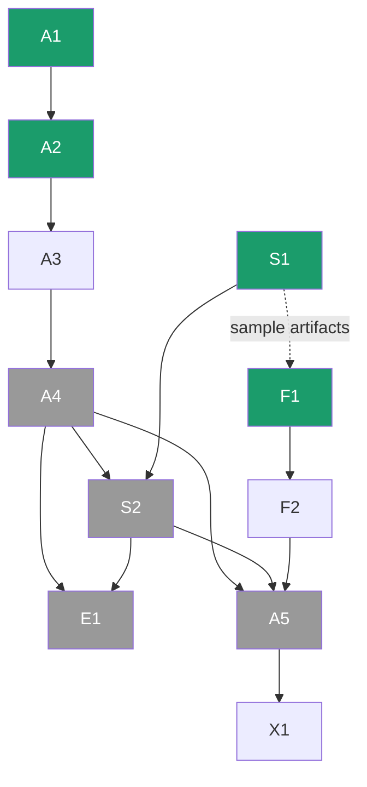

# Tracker.md — Project Backbone

> **This is the single source of truth for coordination.** Status, ownership, what to do next, and where to wait for others all live here. Humans update it as they work; **agents (Claude Code / Codex) read it first, work only within their assigned lane, and update it when done.**
>
> **Reading order for an agent:** §0 Identify yourself → §1 Operating Protocol → §2 Rules → your lane in §6 Task Board. Everything else is reference.

**Last updated:** 2026-06-22 · **Phase:** Build kickoff (all 11 docs complete) · **Overall:** 🟢 on track

---

## §0 · START HERE — Identify Yourself (the router)

**First action every session:** determine which team member you are working for. If the user hasn't said, ask: *"Which team member am I working as — Akshat, Shaivi, or Saanvi?"* Then read **only your lane**, respect the boundaries, and do not modify anything outside your ownership.

| If you are… | You own (edit freely) | Your job | Your next task | **Never touch** (warn instead) |
|---|---|---|---|---|
| **Akshat** | `src/pipeline/p1_segment/`, `notebooks/`, data-pipeline scripts, integration glue in `src/app/main wiring`, `requirements.txt`, `SETUP.md` | ML / segmentation, data pipeline, end-to-end integration, coordination | **A1** | Shaivi's `p2_graph/`, `p3_analysis/` internals · Saanvi's dashboard UI in `src/app/` (only touch the integration contract, with a heads-up) |
| **Shaivi** | `src/pipeline/p2_graph/`, `src/pipeline/p3_analysis/` | graph build + healing, criticality + resilience (classical Python, **CPU only**) | **S1** | `p1_segment/` model code · `src/app/` dashboard UI · `notebooks/` training |
| **Saanvi** | `src/app/` (Streamlit dashboard), `docs/Design.md` | frontend / dashboard (**CPU only**, runs off `data/sample/`) | **F1** | Any `src/pipeline/` code — you **consume** its artifacts, you don't edit it |

**Boundary rule for agents (enforce this):** if you are asked to change something outside your owner's lane, **stop and warn** using the templates in §1. Do the polite thing: flag it, don't silently do it.

---

## §1 · Agent Operating Protocol

Every session, in order:
1. **Identify your owner** (§0). Load §2 rules + §4 contracts + your lane's tasks in §6.
2. **Pick the next task:** your owner's lowest-ID task that is `🔄` or `⏳ ready` and **not** `🔒 blocked`.
3. **If it's blocked,** find what it waits on (§6 "Waits on" column / §7), and tell the user — don't force it. Offer a ready alternative.
4. **Do the task inside your lane only.** Read inputs from the paths in §4; write outputs to the contracted paths. Keep code simple and readable (§2).
5. **Run the done-checks** in the task row (smoke test / sanity asserts / artifact matches contract).
6. **Update this file:** flip the task status, add a one-line §10 daily-log entry. Keep task IDs stable.
7. **If you must change a shared contract** (artifact format, a shared interface), STOP, warn the user, and update §4 explicitly — a silent contract change breaks someone else's work.

**Hard "never" list:** violate §2 rules · edit another owner's files · invent results/metrics/citations · commit secrets or raw/restricted data · switch the resilience metric · introduce a database/auth/REST/JS-SPA.

**Warning templates (use verbatim-ish):**
- *Out of lane:* "⚠️ That's **{Owner}'s** area (task **{ID}**, files `{path}`). I shouldn't modify it as **{You}**. Options: switch me to {Owner}, or I'll log this as a request for them in the Tracker."
- *Blocked / wait for someone:* "⏳ **{ID}** is blocked — it needs `{artifact}` from **{Owner}'s** task **{dep-ID}**, which isn't done yet. While we wait, I can do **{ready-ID}** instead. Want that?"
- *Contract change:* "🛑 Doing this changes a shared artifact contract (`{artifact}`) that **{Owner}** depends on. I've paused — confirm and I'll update §4 and ping {Owner}."

---

## §2 · Ground Rules (non-negotiable — from `Rules.md`)

- **Stack:** Streamlit + Folium, **pure Python**. ❌ no React/JS SPA · ❌ no database (file-based artifacts) · ❌ no REST API · ❌ no auth in v1.
- **ML:** **fine-tune pretrained models only** (no training from scratch). **PyTorch only** (not TensorFlow).
- **Resilience Index = global efficiency** ratio (finite when the graph disconnects). ❌ never raw average-path-length ratio.
- **Compute:** training is **hardware-agnostic via Colab/Kaggle** (or an optional local NVIDIA GPU); **graph + dashboard run on CPU**. No one remote-accesses anyone's machine.
- **Runnable by everyone:** committed `data/sample/` artifacts let the dashboard + analysis run with no GPU and no prior pipeline run.
- **Repo hygiene:** keep it **neutral/generic** (no private hardware specifics, no secrets); `.gitignore` raw data + checkpoints; respect dataset licenses (OSM ODbL, OpenSatMap non-commercial, Cartosat restricted).
- **Code:** simple and readable over clever; type hints + short docstrings; config not hardcoded.
- **Git (see §11 for full workflow):** branch off **`dev`** (never `main`) as `<you>/<task-id>-<slug>`; when the task's done-criteria are met, **open a PR into `dev` and stop** — do not merge on creation. **Akshat is the only approver.** Only `main`-related: **agents never PR or merge into `main`** (that's Akshat's stage-gate).

---

## §3 · Project Map (fast context)

**What:** extract roads from satellite imagery even where occluded → heal into a routable graph → find critical junctions + a resilience score → interactive dashboard. (Full: `PRD.md`.)

**Pipeline (phases hand off by file):**
`imagery + OSM → [P1 segment] → mask → [P2 skeletonize+heal] → graph → [P3 criticality+resilience] → metrics → [P4 dashboard]`

**Target repo layout** (create dirs that don't exist yet, in task A2):
```
data/raw/        (gitignored)      data/interim/      data/processed/
data/outputs/    data/sample/      (COMMITTED — lets dashboard run with no GPU)
models/          (gitignored)
src/pipeline/p1_segment/  p2_graph/  p3_analysis/
src/app/         (Streamlit dashboard)
notebooks/       (Colab/Kaggle training)
docs/            (the 11 docs)     requirements.txt   SETUP.md   CLAUDE.md   AGENTS.md
```

**Where to look (docs):** `PRD`=what/why · `TRD`=architecture/stack · `Schema`=data shapes · `UserJourney`=flows · `Design`=dashboard UI · `Implementation`=roadmap/milestones · `Rules`=standards · `Research`=literature + hardware verdict · `Evaluation`=metrics + experiments · `RiskRegister`=risks · **`Tracker` (this)**=status + coordination.

---

## §4 · Artifact Contracts (the interfaces — keep stable)

These files ARE the handoffs. If your input doesn't exist, you **wait for its producer** (§7).

| Producer (owner) | Artifact | Path | Schema / format | Consumer(s) |
|---|---|---|---|---|
| P1 (Akshat) | road mask | `data/interim/{aoi}_mask.png` | binary {0,1}, same size as input tile | P2 |
| P2 (Shaivi) | healed graph | `data/processed/{aoi}_graph.graphml` (+ `.geojson`) | NetworkX graph; nodes have `x,y,betweenness,is_critical`; edges have `length_m>0,is_bridged` (see `Schema.md`) | P3, P4 |
| P3 (Shaivi) | criticality + resilience | `data/processed/{aoi}_criticality.csv` | per-node `node_id,betweenness,rank,is_critical`; resilience curve | P4 |
| Shaivi (early) | **sample set** | `data/sample/{aoi}_graph.geojson`, `_criticality.csv` | small, committed, real-shaped | **P4 dashboard runs out-of-the-box** |
| P4 (Saanvi) | dashboard | `src/app/app.py` | reads the above; in-process `simulate_ablation(graph, node)` | end user |

**Golden rule:** consume artifacts at these exact paths/shapes. Changing a shape is a §1 contract change.

---

## §5 · Ownership & Boundaries

**Owned outright (edit freely):** as in §0.
**Shared — coordinate before editing (warn the user, note in §10):** `requirements.txt`, `SETUP.md`, this `Tracker.md`, §4 contracts, any shared `config`.
**Read-only for consumers:** Saanvi reads pipeline artifacts but never edits pipeline code; P3 reads P2's graph but doesn't rewrite P2.

If two tasks would touch the same shared file, the later one waits or coordinates — don't both edit blindly.

---

## §6 · Task Board

`ID · status · task — owner — waits on → blocks · done-when`. **Status:** ✅ done · 🔄 in progress · ⏳ ready (do now) · 🔒 blocked.

> **Every task's "done" also includes:** open a PR into `dev` (per §11) and update this Tracker — a task isn't done until its PR is up and the status is flipped.

### Completed
| ID | Task | Owner |
|---|---|---|
| D0 ✅ | Repo + docs scaffolding (`Index.md`, CODEOWNERS) | Akshat |
| D1 ✅ | All 11 documentation files (Phases 1–4) | Akshat (Design: Saanvi) |

### Akshat — ML / data / integration
| ID | Status | Task | Waits on | Blocks | Done when |
|---|---|---|---|---|---|
| **A1** | ✅ | Environment + pinned `requirements.txt` + `SETUP.md` | — | A3, everyone's setup | core libs import on a clean env; `requirements.txt` + `SETUP.md` committed — verified on Akshat's Windows machine: `pip install -r requirements.txt` succeeds, `import streamlit, folium, networkx, skimage, sknw, rasterio, osmnx` → `CPU env OK` |
| **A2** | ✅ | Repo skeleton (`src/`, `data/`, `notebooks/`, `.gitignore`) | — | A3, F1, S1 outputs | dirs exist; `data/raw`+`models/` gitignored; `data/sample/` placeholder present — created `src/pipeline/{p1_segment,p2_graph,p3_analysis}`, `src/app`, `data/{raw,interim,processed,outputs,sample}`, `models/`, `notebooks/` with `.gitkeep`; `.gitignore` ignores `data/raw|interim|processed|outputs/*` + `models/*` (kept placeholders via `dir/*` + negated `.gitkeep`) |
| **A3** | ⏳ | Data pipeline: download/cache + tiling + **OSM→mask** script | A1, A2 | A4 | produces aligned `{aoi}_mask`-style labels in `data/interim/`; QC'd on 1 tile |
| **A4** | 🔒 | Fine-tune segmentation (SegFormer/U-Net) — Colab/Kaggle notebook | A3 | S2, A5, E1 | model outputs a real road mask; IoU/Occlusion-Recall logged |
| **A5** | 🔒 | Walking skeleton → end-to-end integration on 1 tile | A4, S2, F2 | X1 | one tile flows P1→P2→P3→P4 without manual steps |

### Shaivi — graph + resilience (CPU, no GPU)
| ID | Status | Task | Waits on | Blocks | Done when |
|---|---|---|---|---|---|
| **S1** | 🔄 | Graph/resilience spike on an **OSM graph** | — (starts now) | F1 (sample), S2 | osmnx→skeleton→sknw→**MST/Union-Find healing**→betweenness→ablation→**global-efficiency RI** run end-to-end; exports `data/sample/{aoi}_graph.geojson` + `_criticality.csv` |
| **S2** | 🔒 | Run healing + criticality on **real predicted masks** | A4 (mask) | A5, E1 | same pipeline consumes P1 mask → `data/processed/` graph + criticality |

### Saanvi — dashboard (CPU, off `data/sample/`)
| ID | Status | Task | Waits on | Blocks | Done when |
|---|---|---|---|---|---|
| **F1** | 🔄 | Dashboard env + scaffold on sample artifacts | uses S1 sample (mock OK until then) | F2 | Streamlit+folium app loads `data/sample/`, renders roads coloured by criticality + legend; map ~65% / panel ~35% per `Design.md` |
| **F2** | ⏳ | Full dashboard: click-to-disable sim + rerouting + travel-time + charts | F1 | A5 | clicking a node disables it, reroutes, shows RI drop + travel-time %, updates instantly |

### Shared / final
| ID | Status | Task | Owner | Waits on |
|---|---|---|---|---|
| **E1** | 🔒 | Evaluation suite + ablations (`Evaluation.md`) | Akshat (seg) · Shaivi (graph) | A4, S2 |
| **X1** | ⏳ | Backup demo screen-capture | All | A5 |

### Bugs / Issues
| ID | Type | Description | Owner | Status |
|---|---|---|---|---|
| I-1 | issue | GDAL/rasterio installs differ per machine — solve in A1, document the fix in `SETUP.md` | Akshat | 🔄 |

---

## §7 · Coordination & Wait-Points (where to wait for whom)



**Plain-English wait list:**
- **Saanvi (F1/F2)** can start **now** on mock data, then swap to **Shaivi's S1 sample artifacts** when ready. She **waits on Shaivi** only for *real-shaped* data, never to begin.
- **Shaivi's S2** waits on **Akshat's A4** (the predicted mask). Until then she works **S1** (OSM graph) — never idle.
- **Akshat's A4** waits on **A3** (data pipeline), which waits on **A1/A2**.
- **A5 integration** waits on **A4 + S2 + F2** (all three lanes converge). It's the last big step.
- **E1 evaluation** waits on **A4 + S2**.

**Nobody is ever blocked at the start:** A1/A2 (Akshat), S1 (Shaivi), F1 (Saanvi) are all 🔄 ready in parallel.

---

## §8 · Decisions Log (locked — don't re-litigate)

| Decision | Rationale | Status |
|---|---|---|
| Resilience Index = **global efficiency** | raw avg-path-length → ∞ when graph disconnects | 🔒 locked |
| Frontend = **Streamlit + Folium** (pure Python) | team skill + CPU-friendly + fast to build | 🔒 locked |
| **File-based** artifacts, no DB/auth/REST in v1 | single-machine, read-mostly; DB adds no value | 🔒 locked |
| Segmentation = **fine-tune pretrained** only | fits compute budget; no time to train from scratch | 🔒 locked |
| Training **hardware-agnostic** (Colab/Kaggle); **no remote access** | everyone runs the same; each sets up their own machine | 🔒 locked |
| Repo kept **neutral/generic** | public-safe; no hackathon/hardware identity | 🔒 locked |

---

## §9 · Status Snapshot

- **Docs:** ✅ 11/11 complete. **Build:** kickoff.
- **In flight:** A1 (Akshat env), S1 (Shaivi graph spike), F1 (Saanvi dashboard scaffold) — three lanes in parallel.
- **Next convergence:** S1 → produces sample artifacts that unblock F1's real data; A1→A2→A3→A4 → unblocks S2/E1; then A5 integration.
- **Top risk to clear early:** environment setup (esp. any local GPU + GDAL/rasterio) — see `RiskRegister.md` I-1/I-2; cloud path makes it non-blocking.

---

## §10 · Daily Logs

> Copy the block each working day. Newest on top.

**2026-06-23**
- Done: A1 ✅ — pinned `requirements.txt` (fixed invalid `sknw==0.1.5` → `0.15`); verified on Akshat's Windows machine (`pip install` + import check → `CPU env OK`). Discovered conda isn't required on Windows; updated `SETUP.md` Path A + Troubleshooting to make conda an optional fallback instead of a required first step.
- Done: A2 ✅ — repo skeleton created (`src/pipeline/{p1_segment,p2_graph,p3_analysis}`, `src/app`, `data/{raw,interim,processed,outputs,sample}`, `models/`, `notebooks/`) with `.gitkeep` placeholders; `.gitignore` added (`data/raw|interim|processed|outputs/*` + `models/*` ignored, placeholders kept, `data/sample/` fully committed).
- In progress: Shaivi → S1. Saanvi → F1.
- Blockers: none.
- Next: Akshat → A3 (OSM→mask data pipeline script), now unblocked.

**2026-06-22**
- Done: all 11 docs complete; Tracker rebuilt as the agent backbone (router + boundaries + wait-points + protocol); cloud-first/no-remote-access plan locked.
- In progress: Akshat → A1/A2. Shaivi → S1. Saanvi → F1.
- Blockers: none.
- Next: A1+A2 unblock A3; S1 emits first `data/sample/` artifacts for F1.

```
**YYYY-MM-DD** (newest on top)
- Done:
- In progress:
- Blockers / waiting on:
- Next:
```

---

## §11 · Git & Branching Workflow

**Branch model:**
```
main   ← production. Only Akshat PRs dev→main, at stage completion. Agents NEVER touch this.
 └ dev  ← integration. All task PRs land here.
    ├ akshat/A3-osm-mask
    ├ shaivi/S1-graph-healing
    └ saanvi/F1-dashboard-scaffold
```

**One branch per task** (not per person) — it maps to the task IDs in §6 and keeps PRs small.

**Agent git rules (follow exactly):**
1. **Branch off `dev`**, never `main`: `git checkout dev && git pull && git checkout -b <you>/<task-id>-<slug>` (e.g. `shaivi/S1-graph-healing`).
2. Do the task **inside your ownership lane** (§0/§5). Commit with clear messages (`feat(graph): add union-find healing`).
3. When the task's **done-criteria** (§6) are met, **open a PR into `dev`** and **STOP**. ❌ Do not merge on creation. ❌ Never push directly to `dev` or `main`.
4. **Request review from Akshat** (the only approver) in the PR.
5. **Self-merge is a catch-up only:** an agent may merge **its own** PR **only if** it has verified the PR is **(a) approved by Akshat AND (b) still open/unmerged**. Otherwise leave it for Akshat to merge. Check before merging:
   ```bash
   gh pr view <number> --json reviewDecision,state,mergedAt
   # merge only if reviewDecision == "APPROVED" and state == "OPEN" and mergedAt == null
   ```
6. **`main` is off-limits to agents:** never open, approve, or merge a PR into `main`. Stage completion (dev→main) is **Akshat's** manual decision.
7. After a merge, update the task to ✅ in §6 and add a §10 log line.

**Akshat's lane (human):** approve PRs into `dev`; merge them (or let the approved-PR self-merge catch-up handle ones you miss); and PR `dev→main` when a stage is complete.

**Warning template (agent, when asked to cross the git boundary):** "⚠️ That would push/merge into `{branch}`. As an agent I only branch off `dev` and open PRs into `dev` — I can't touch `main`, and I don't merge unless this PR is already approved-and-unmerged. I'll open the PR and leave the merge to Akshat."


## §12 · How to Update This File

- Change a task's **status emoji** the moment it changes; never delete a task — mark it ✅.
- **Keep task IDs stable** (agents reference them). Add new tasks with new IDs (A6, S3, F3…).
- Add a **§10 log line** for anything meaningful you did.
- Changed an **artifact contract** (§4) or a **shared file** (§5)? Note it in §10 and warn the affected owner.
- Treat §0–§5 and §8 as **stable**; §6, §9, §10 are the parts that change daily.