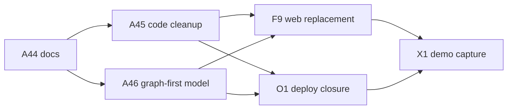

# Tracker.md — Project Backbone

> **Source of truth for current ownership, active work, contracts, and locked decisions.**
> Detailed experiment evidence belongs in `Evaluation.md` and `Research.md`; this file stays concise enough to route the next task correctly.

**Last updated:** 2026-07-16 · **Phase:** A46/P2/P3 verification active · **Overall:** core product working; corrected contracts and authorized web replacement remain

---

## §0 · START HERE — Identify Yourself

At the beginning of a session, identify the team member you are working for. If the user has not said, ask:
*“Which team member am I working as — Akshat, Shaivi, or Saanvi?”*

| Team member | Default ownership | Current next task |
|---|---|---|
| **Akshat** | `src/pipeline/p1_segment/`, data tooling, notebooks, integration, shared configuration and coordination | **A46** graph-first model improvement |
| **Shaivi** | `src/pipeline/p2_graph/`, `src/pipeline/p3_analysis/` | Support **A46** routing-based selection and calibration |
| **Saanvi** | current `src/app/`, product design and future web frontend | **F9** web-experience replacement after A45/A46 |

**Current coordinator authorization:** Akshat authorized the active agent to work across **the whole project/all three lanes**. On 2026-07-14 he explicitly superseded the Streamlit/Folium stack lock and authorized selection of a replacement web stack for F9. Keep cross-lane and architecture changes reviewable and record them here; this authorization does not remove code review or artifact-contract checks.

---

## §1 · Agent Operating Protocol

Before each work turn:

1. Check remote state with both `gh pr list --state open` and `gh pr list --state merged --limit 10`.
2. Read §0–§2, §4, and the active row in §6.
3. Work from a branch created from current remote `dev` as `<owner>/<task-id>-<slug>`.
4. Preserve §4 contracts unless a contract change is explicit, documented, tested, and coordinated.
5. Define a measurable done-check before editing. Refactors require behavior tests plus a size or performance comparison; model work requires the frozen promotion gate in `Evaluation.md`.
6. Run the relevant focused tests, then the full suite when the task is complete.
7. Update §6 and add a concise §10 log entry.
8. Open a PR into `dev` and stop. Do not merge it on creation.

For each still-open PR, inspect both reviews and inline review comments. Address owned comments before starting unrelated work.

**Warnings:**

- Out of lane without coordinator authorization: “⚠️ That is **{Owner}’s** area (`{path}`). Switch me to {Owner}, authorize a coordinated cross-lane change, or I will log it for them.”
- Blocked artifact: “⏳ **{ID}** needs `{artifact}` from **{dependency}**. I will work on `{ready alternative}` while it is unavailable.”
- Contract change: “🛑 This changes the shared `{artifact}` contract. I have paused until the producer and consumers agree and §4 is updated.”

---

## §2 · Ground Rules

- **Product stack:** the deployed baseline remains Streamlit/Folium until F9 reaches verified parity. F9 is authorized to replace it with a performance-budgeted web frontend and thin Python API while preserving the Python ML/graph core and §4 contracts. A database/login product remains out of scope unless separately justified and recorded.
- **GPU boundary:** uploaded imagery is sent to the authenticated Modal segmentation endpoint; P2/P3 and simulations remain CPU-capable on the application host.
- **ML:** fine-tune pretrained models only; PyTorch only. Training may use Colab, Kaggle, or an optional local NVIDIA GPU.
- **Runtime:** graph analysis and the dashboard must remain CPU-capable. Committed `data/sample/` artifacts keep the demo runnable without a checkpoint.
- **Metric:** Resilience Index is the ratio of global efficiency to the baseline graph. It must remain finite and bounded in `[0, 1]`; never substitute raw average path length. Single-scenario and multi-step paths preserve the baseline node universe; failed nodes remain as isolates.
- **Evidence:** do not invent metrics, citations, deployment state, or generalization claims. Negative results are first-class results.
- **Benchmark honesty:** SpaceNet-5 Mumbai is a repeatedly consulted **development benchmark**, not an untouched final test set.
- **Repository hygiene:** no secrets, raw/restricted datasets, or model checkpoints in Git. Preserve licenses and public-safe wording.
- **Code:** prefer simple functions and measured improvements over speculative abstractions. Every changed line must support the task.
- **Git:** branch from `dev`; PR only into `dev`; agents never PR or merge into `main`.

---

## §3 · Current Product and Architecture

Route Resilience turns satellite imagery into a road-resilience analysis:

`imagery → P1 segmentation → probability/mask → P2 MultiGraph + healing → P3 criticality/resilience → P4 dashboard`

Two entry paths share the same P2/P3 logic:

1. **Batch/local:** `python -m src.pipeline.run_pipeline` executes P1–P3 and verifies the P4 artifact seam.
2. **Hosted upload:** Streamlit sends image bytes to an authenticated Modal GPU endpoint for P1, then queues CPU P2/P3 work on the Oracle host.

Current release state:

- Public dashboard: `https://trace.tiwaribabu.in`
- Repository/intended production segmentation model: `a4-roadseg-v3.2` (`road_pan.pt`, threshold `0.52`); O1 must verify the live Modal checksum
- Current research direction: graph-first SAM-Road++/A18, validated by a common-unit chip APLS gate but not deploy-ready
- Test state at A44 start: 284 local tests passed; remote `dev` CI green

Approved target direction: F9 will replace only the presentation/application boundary after A45/A46. The current app remains the parity oracle until the new browser flows, upload recovery, accessibility, performance and deployment checks pass; then the Streamlit/Folium presentation is removed rather than maintained in parallel.

---

## §4 · Artifact Contracts

These paths are the stable handoffs. Producers may add optional sidecars, but consumers must continue to handle the required artifact.

| Stage | Required artifact | Path | Required contract | Consumers |
|---|---|---|---|---|
| P1 | Binary road mask | `data/interim/{aoi}_mask.png` | Binary road/background image aligned to the source grid | P2 |
| P1 | Alignment manifest | `data/interim/{aoi}/manifest.json` when georeferenced | CRS, affine transform, width/height, metric conversion metadata | P2 |
| P1 | Probability map | `data/interim/{aoi}/prob.png` when blended inference is used | Same grid as mask; optional confidence input for healing | P2 |
| P1 | Provenance | `data/interim/{aoi}/provenance.json` | Checkpoint name/SHA-256, encoder, architecture, threshold, image size, Git commit and creation time | P2/P3/reporting |
| P2 | Healed graph | `data/processed/{aoi}_graph.graphml` and `_graph.geojson` | NetworkX MultiGraph; positive `length_m`; geometry and `edge_key` preserved; inferred edges flagged | P3/P4 |
| P3 | Criticality | `data/processed/{aoi}_criticality.csv` | At least `node_id,betweenness,rank,is_critical,is_articulation,x,y`; graph annotations resaved | P4 |
| P3 | Resilience curve | `data/processed/{aoi}_resilience.csv` | Targeted/random efficiency, RI, and component fractions by removals | P4/evaluation |
| Pipeline | Run summary | `data/processed/{aoi}_run.json` | Status, timings, resolved config, stage reuse, provenance | Operators/evaluation |
| Demo | Sample set | `data/sample/panaji_demo_*` | Committed, contract-shaped, CPU-runnable artifacts | P4/CI |

Contract invariants:

- `aoi` is sanitized before interpolation into paths.
- Graph coordinates and lengths use metres when georeference exists; pixel-space fallback must be explicit.
- GraphML and GeoJSON represent the same analyzed graph.
- Stage reuse is content/config-signature based, not mtime-only.
- A stage manifest means that stage completed with its recorded signature; only a successful end-to-end run writes `{aoi}_run.json`.

---

## §5 · Ownership and Coordination

Default ownership remains useful for review even during coordinator-authorized work:

- Akshat reviews ML, data, integration, dependencies, deployment wiring, and shared contracts.
- Shaivi reviews graph construction, graph IO, centrality, APLS, and resilience semantics.
- Saanvi reviews dashboard behavior, accessibility, and visual design.

Shared files include `requirements*.txt`, `SETUP.md`, deployment files, `src/pipeline/config.py`, and this Tracker. A change that crosses a §4 seam must name both producer and consumer tests in its PR.

---

## §6 · Task Board

Status: ✅ done · 🔄 active · ⏳ ready · 🔒 blocked · ⏸ parked/superseded.

### Active consolidation program

| ID | Status | Task | Owner | Depends on | Done when |
|---|---|---|---|---|---|
| **A44** | ✅ | Reconcile and simplify all documentation | Akshat/coordinator | — | Current docs agree with code/evidence, historical audit archived, sample graph/APLS evidence refreshed, links/JSON/mirrors checked, 284 tests green; PR opened into `dev` |
| **A45** | ✅ | Repository-wide correctness, simplification and performance refactor | Coordinator across all lanes | A44 | Baseline-universe resilience, one probability inference protocol, evaluator labels, immutable deploy refs and CLI precedence corrected; duplicated/dead logic reduced; focused benchmarks improved; 318 tests green |
| **A46** | 🔄 | Graph-first model improvement program | Akshat | A44; use A45 foundations where relevant | Reproducible/license-safe run contract; existing-checkpoint APLS selection and threshold/radius calibration first; deterministic LoRA capacity study only if needed; 102-chip selection and one pre-registered 127-chip comparison; no promotion without material paired/absolute gains and deployment checks |
| **O1** | ⏳ | Close production operator checklist | Akshat | approved release ref | Modal/app redeployed from an immutable ref; port 8501 closed; service/Caddy/journald config installed; live upload smoke passes; rate limiting decision recorded |
| **F9** | 🔒 | Replace Streamlit/Folium with a researched web experience | Saanvi/coordinator | A45 and A46 | Current capabilities preserved through a thin Python API; striking visual system, responsive/accessibility flows and real browser journeys verified; bundle/payload/Web-Vitals/map budgets pass; old presentation removed |
| **X1** | 🔒 | Final backup demo capture | All | F9, O1 | Capture demonstrates sample flow and uploaded-image flow from the approved release |

### Research backlog disposition

| IDs | Disposition | Reason |
|---|---|---|
| A13–A15 | ⏸ parked | Mask-ensemble/larger-encoder/decoder variants are lower-value after the graph-first A18 gate; revisit only if A46 evidence points back to masks |
| A20, A22 | ⏸ retired with A12 | They optimize the rejected mean-teacher self-training path |
| E2 | ✅ superseded | Connectivity and routing are covered by common-unit chip APLS, fragmentation diagnostics and paired uncertainty; the unfinished relaxed-IoU row is retired rather than claimed as complete |
| E3 | ✅ negative result | Heavy occlusion and clDice-first fine-tunes did not help; retained as opt-in experimental code/evidence, not product defaults |
| E5 | folded into A45/A46 | Configuration, seeds, provenance, run summaries, and experiment output must be part of each active task rather than a detached meta-task |

### Completed foundation

- A1–A12, A16–A17, A19, A21, A23–A28: environment, data, released segmentation models, evaluation and correctness foundations.
- S1–S11: MultiGraph extraction/healing, graph IO, criticality, APLS, resilience and scenario analysis.
- F1–F8: working Streamlit/Folium dashboard, simulation, flood selection, exports, caching and accessibility hardening.
- July hardening program: deployment, UI/product hardening, MultiGraph migration, queue/probability-map work, audit fixes, and the v3.2/A41 evaluation cycle.
- A18 initial and LoRA spikes: graph-first direction validated; continuation is A46.

---

## §7 · Coordination and Wait-Points

```mermaid
flowchart LR
    A44["A44 docs"] --> A45["A45 code cleanup"]
    A44 --> A46["A46 graph-first model"]
    A45 --> F9["F9 web replacement"]
    A46 --> F9
    A45 --> O1["O1 deploy closure"]
    A46 --> O1
    F9 --> X1["X1 demo capture"]
    O1 --> X1
```

- A44 may document code problems but does not silently refactor them.
- A45 establishes a smaller, measured codebase before more model or UI complexity is added.
- A46 may run research in parallel with later A45 work, but deployment integration waits for A45 contracts to settle.
- F9 is intentionally last: replace the presentation around stable domain/model outputs, using the current app as a temporary parity oracle.
- O1 requires access to the live services; repository work alone cannot prove it complete.

---

## §8 · Decisions Log

| Decision | Status | Rationale |
|---|---|---|
| Resilience Index = baseline-normalized **global efficiency** | 🔒 | Finite under disconnection; all paths preserve the baseline node universe, including corrected multi-step ablation |
| Streamlit + Folium as permanent stack | superseded 2026-07-14 | Akshat authorized a full web replacement; preserve domain contracts and CPU deployment while selecting the new presentation/API stack through research and measured budgets |
| File artifacts, no database/login | 🔒 | Small-team reproducibility and simple operations |
| Modal is the sole remote inference boundary | 🔒 | GPU work stays off the ARM host; P2/P3 remain in-process |
| v3.2 remains deployed | 🔒 until a gate win | Best current deployable mask model; later pixel-only candidates did not improve routing safely |
| Mumbai is a development benchmark | 🔒 | Repeated model consultation invalidates untouched-test claims |
| Promotion metric = strict common-unit chip APLS with paired uncertainty | 🔒 | Prevents tile/chip frame confounds and requires coverage/comparability |
| Graph-first is the next model direction | 🔒 for A46 | A18 frozen and LoRA runs beat v3.2 on common-unit routing; absolute routing remains too low for deployment |
| Immutable deployment refs with rollback | 🔒 | Production must not auto-deploy moving `dev` |

---

## §9 · Status Snapshot

- **Product:** end-to-end batch and hosted-upload paths exist; sample dashboard and CPU analysis are runnable.
- **Quality:** 318 local tests pass after A45; CI covers the full suite and the production dependency smoke.
- **Deployment:** public dashboard responds, but the repository cannot prove the operator checklist or latest Modal/app rollout is complete.
- **Model:** v3.2 deployed; A18-LoRA is a strong research result, not a release candidate.
- **Evidence gap:** no untouched new-city/new-sensor final test and no labeled real Cartosat-PAN evaluation.
- **Immediate work:** execute A46; researched web replacement F9 and O1 follow before X1.

---

## §10 · Daily Log

**2026-07-16 (Akshat/coordinator — A46 checkpoint selected; calibration registered)**

- Completed all 27 checkpoint runs on the frozen 102-chip selection split with complete coverage and verified manifests. Epoch 22 leads epoch 18 by raw APLS `+0.045353`, paired 95% CI `[+0.029138, +0.063363]`; normalized APLS is `0.244357`, so the frozen `0.25` absolute floor correctly blocks promotion.
- Registered `data/sample/a46_calibration_plan.json` before calibration: fixed epoch 22, 600 APLS samples per chip, topology-threshold stage, bounded one-variable fallback families, exact selection rule and stopping rule. The 127-chip comparison remains closed.
- P2/P3 takeover tests exposed remaining route-pair and sampled-efficiency gaps; focused fixes continue before any web API is allowed to treat those artifacts as authoritative.

**2026-07-15 (Akshat/coordinator — A46 and full-lane verification started)**

- Akshat reconfirmed authorization across every lane, explicitly including P2/P3, and authorized focused workflow merges through the complete UI/UX replacement.
- Froze a disjoint 102-chip A46 selection manifest and pre-registered the candidate-vs-LoRA floors before selection: paired raw APLS gain `>=0.02`, positive paired CI, and normalized APLS `>=0.25`. The evaluator now supports explicit manifests, incumbent comparison, per-chip routing/fragmentation/runtime evidence and local run provenance; the 127-chip comparison remains closed until a candidate is registered.
- A full P2/P3 audit is running before F9 so the new interface cannot present invalid topology or resilience results. Confirmed P2 blockers include transitive junction consolidation over hundreds of metres, dropped closed-loop roads, and incomplete coordinate/artifact validation; each requires a regression and regenerated evidence before UI parity is accepted.

**2026-07-15 (Akshat/coordinator — A45 PR follow-up)**

- PR #128 CI exposed Windows/Ubuntu newline-dependent hashes in the sample evidence manifest. The artifact bytes are unchanged; explicit LF attributes and canonical text hashing make the contract platform-independent. Full verification remains **318 passed, 2 upstream warnings**.

**2026-07-14 (Akshat/coordinator — A45 complete)**

- Corrected multi-step resilience to preserve the baseline node universe, fixed bridge-label semantics, and regenerated the Panaji graph/resilience/flood/percolation evidence with a source-and-artifact hash manifest. The upload path now uses the same resilience contract; its corrected sample RI is 0.313810 rather than the shrinking-universe 0.470715.
- Unified training, validation, occlusion and threshold selection on Hann-blended probability inference with protocol provenance. Streaming large-image prediction is bitwise-equivalent on checked 512–4096 px inputs and reduced peak allocation proxies by 16.6–63.8% without claiming a CPU speedup.
- Reused one mask-to-graph constructor across batch and upload paths; made APLS source routing 2.86× faster on the recorded synthetic benchmark, curved-edge densification 12.9× faster, and the training-loss microbenchmark about 46.8% faster while preserving outputs.
- Enforced immutable deployment refs, corrected CLI/config precedence and portable help text, cached repeated file hashing per run, split dependencies by app/train/dev role, and reduced the training notebook from 40,981 to 4,432 bytes by delegating to maintained experiment code.
- Final verification: **318 passed, 2 upstream warnings**; Python compilation, CLI help, dashboard import, dependency parsing, Bash syntax, documentation/link/mirror checks and sample-evidence hashes passed.

**2026-07-13 (Akshat/coordinator — A44 started)**

- Akshat explicitly authorized repository-wide work across all ownership lanes.
- Created `akshat/A44-docs-reconciliation` from current remote `dev` and carried forward the stranded A18-LoRA documentation commit.
- Audit finding: the docs mixed the pre-build plan, shipped v3.2 architecture, and A18 direction. A44 consolidates them before code/model/UI work.
- Verification baseline: 284 tests passed locally; dashboard import and production mask-to-resilience smoke passed; remote `dev` CI green.
- Replaced the pre-build/current/research mixture with one current architecture and roadmap across README, SETUP, PRD, TRD, Schema, Design, UserJourney, Implementation, Rules, Risk, Evaluation and Research.
- Reduced Tracker from 717→236 lines and the active issue ledger from 682→49 lines; preserved the original review as `docs/ProductionReadinessAudit-2026-07.md`.
- Corrected case-sensitive `AGENTS.md`/`CLAUDE.md` discovery and mirrored the current Modal/coordinator rules.
- Regenerated current Panaji graph/APLS evidence (364 nodes/500 edges; APLS 0.5369) and explicitly withheld provisional multi-step RI claims pending A45.
- Model audit prioritized existing-checkpoint APLS selection and inference calibration before more training; documented fragmentation, compute/storage and license/reproducibility gates.
- A45 now owns the concrete defects exposed by truthful docs: shrinking-node RI curves, mixed inference protocols, evaluator labels, immutable-ref enforcement, Methodology labeling, CLI/config precedence and Windows help portability.
- Final A44 verification: local links resolve; sample JSON parses; Markdown fences and agent mirrors pass; full suite **284 passed, 2 upstream warnings**.

Historical experiment details remain in `Research.md`, `Evaluation.md`, `Retrospective-A6-A11.md`, release notes, and Git history. New logs stay concise and link to the evidence-bearing document.

---

## §11 · Git and Branching Workflow

1. Synchronize remote state; branch from `dev`, never `main`.
2. Name the branch `<owner>/<task-id>-<slug>`.
3. Keep one coherent task per PR; do not bundle docs, refactors, model experiments, and UI redesign unless the shared contract makes separation impossible.
4. Run done-checks and update this Tracker before opening the PR.
5. Open the PR into `dev` and stop. Akshat is the approver; never target `main`.
6. A task branch may be merged only after Akshat approval. Agents do not self-merge a newly created PR.
7. For stacked work, retarget the child PR to `dev` after its base merges and re-check the resulting diff.

---

## §12 · How to Update This File

- Keep §0 next-task pointers and §6 statuses current.
- Put interfaces in §4, irreversible choices in §8, and only short progress evidence in §10.
- Put detailed metrics in `Evaluation.md`; literature, hypotheses and negative results in `Research.md`; operational instructions in `deploy/README.md`/`SETUP.md`.
- Do not paste long experiment transcripts here.
- Update the `Last updated` date whenever status or decisions change.
