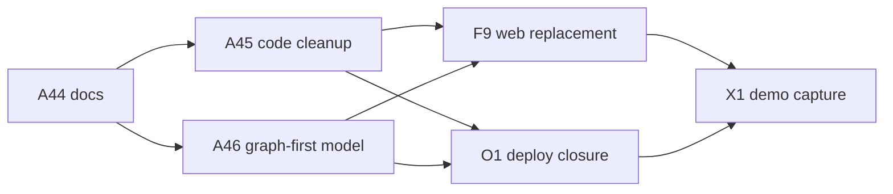

# Tracker.md — Project Backbone

> **Source of truth for current ownership, active work, contracts, and locked decisions.**
> Detailed experiment evidence belongs in `Evaluation.md` and `Research.md`; this file stays concise enough to route the next task correctly.

**Last updated:** 2026-09-29 · **Phase:** maintenance · **Overall:** F12, OPS-3 and F13 are live at immutable commit `12d0a5c`; X1 backup demo captured from that release; the Oracle host is patched and runs kernel 7.0

---

## §0 · START HERE — Owner

**Akshat is the sole owner of the whole project** (since 2026-09-29). Agents always work as Akshat; there are no other ownership lanes and no cross-lane authorization step. Code review and artifact-contract checks still apply.

| Owner | Scope | Current next task |
|---|---|---|
| **Akshat** | Everything: `src/pipeline/` (P1–P3), `src/app/`, `web/`, data tooling, notebooks, deployment, shared configuration and docs | No active task — pick from the `bugs.md` follow-ups |

---

## §1 · Agent Operating Protocol

Before each work turn:

1. Check remote state with both `gh pr list --state open` and `gh pr list --state merged --limit 10`.
2. Read §0–§2, §4, and the active row in §6.
3. Work from a branch created from current remote `dev` as `akshat/<task-id>-<slug>`.
4. Preserve §4 contracts unless a contract change is explicit, documented, tested, and coordinated.
5. Define a measurable done-check before editing. Refactors require behavior tests plus a size or performance comparison; model work requires the frozen promotion gate in `Evaluation.md`.
6. Run the relevant focused tests, then the full suite when the task is complete.
7. Update §6 and add a concise §10 log entry.
8. Open a PR into `dev` and stop. Do not merge it on creation.

For each still-open PR, inspect both reviews and inline review comments. Address them before starting unrelated work.

**Warnings:**

- Blocked artifact: “⏳ **{ID}** needs `{artifact}` from **{dependency}**. I will work on `{ready alternative}` while it is unavailable.”
- Contract change: “🛑 This changes the shared `{artifact}` contract. I have paused until the producer and consumers agree and §4 is updated.”

---

## §2 · Ground Rules

- **Product stack:** the repository release is a performance-budgeted Next.js/React/MapLibre frontend served by a thin FastAPI application boundary. The Python ML/graph core and §4 contracts remain authoritative. A database/login product remains out of scope unless separately justified and recorded.
- **GPU boundary:** uploaded imagery is sent to the authenticated Modal segmentation endpoint; P2/P3 and simulations remain CPU-capable on the application host.
- **ML:** fine-tune pretrained models only; PyTorch only. Training may use Colab, Kaggle, or an optional local NVIDIA GPU.
- **Runtime:** graph analysis and the application host must remain CPU-capable. Committed `data/sample/` artifacts keep the demo runnable without a checkpoint.
- **Metric:** Resilience Index is the ratio of global efficiency to the baseline graph. It must remain finite and bounded in `[0, 1]`; never substitute raw average path length. Single-scenario and multi-step paths preserve the baseline node universe; failed nodes remain as isolates.
- **Evidence:** do not invent metrics, citations, deployment state, or generalization claims. Negative results are first-class results.
- **Benchmark honesty:** SpaceNet-5 Mumbai is a repeatedly consulted **development benchmark**, not an untouched final test set.
- **Repository hygiene:** no secrets, raw/restricted datasets, or model checkpoints in Git. Preserve licenses and public-safe wording.
- **Code:** prefer simple functions and measured improvements over speculative abstractions. Every changed line must support the task.
- **Git:** branch from `dev`; PR only into `dev`; agents never PR or merge into `main`.

---

## §3 · Current Product and Architecture

Route Resilience turns satellite imagery into a road-resilience analysis:

`imagery → P1 segmentation → probability/mask → P2 MultiGraph + healing → P3 criticality/resilience → P4 field atlas`

Two entry paths share the same P2/P3 logic:

1. **Batch/local:** `python -m src.pipeline.run_pipeline` executes P1–P3 and verifies the P4 artifact seam.
2. **Hosted upload:** FastAPI validates and sends image bytes to the authenticated Modal GPU endpoint for P1, then persists queued CPU P2/P3 work on the Oracle host.

Current release state:

- Public application: `https://trace.tiwaribabu.in`; verified checkout `12d0a5c0fd510b347537c69b35c78d60c9bf5c99` (O2 + OPS-3 + F13), with strict Host/SNI rejection live through the shared Caddy root
- Production segmentation model: `a4-roadseg-v3.2` (`road_pan.pt`, threshold `0.52`); Modal v3.2 is deployed and its checkpoint checksum was verified
- Current research direction: graph-first SAM-Road++/A18, validated by a common-unit chip APLS gate but not deploy-ready

F9 implementation result: the replacement changes only the presentation/application boundary, retains Python P1–P3 logic and file artifacts, passes browser/accessibility/performance gates, and removes the Streamlit/Folium presentation instead of maintaining two stacks.

---

## §4 · Artifact Contracts

These paths are the stable handoffs. Producers may add optional sidecars, but consumers must continue to handle the required artifact.

| Stage | Required artifact | Path | Required contract | Consumers |
|---|---|---|---|---|
| P1 | Binary road mask | `data/interim/{aoi}_mask.png` | Binary road/background image aligned to the source grid | P2 |
| P1 | Alignment manifest | `data/interim/{aoi}/manifest.json` when georeferenced | CRS, affine transform, width/height, metric conversion metadata | P2 |
| P1 | Probability map | `data/interim/{aoi}/prob.png` when blended inference is used | Same grid as mask; optional confidence input for healing | P2 |
| P1 | Provenance | `data/interim/{aoi}/provenance.json` | Checkpoint name/SHA-256, encoder, architecture, threshold, image size, Git commit and creation time | P2/P3/reporting |
| P2 | Healed graph | `data/processed/{aoi}_graph.graphml` and `_graph.geojson` | NetworkX MultiGraph; positive `length_m`; geometry and `edge_key` preserved; inferred edges flagged | P3/P4 |
| P3 | Criticality | `data/processed/{aoi}_criticality.csv` | At least `node_id,betweenness,rank,is_critical,is_articulation,x,y`; graph annotations resaved | P4 |
| P3 | Resilience curve | `data/processed/{aoi}_resilience.csv` | Targeted/random efficiency, RI, and component fractions by removals | P4/evaluation |
| Pipeline | Run summary | `data/processed/{aoi}_run.json` | Status, timings, resolved config, stage reuse, provenance | Operators/evaluation |
| Demo | Sample set | `data/sample/panaji_demo_*` | Committed, contract-shaped, CPU-runnable artifacts | P4/CI |

Contract invariants:

- `aoi` is sanitized before interpolation into paths.
- Graph coordinates and lengths use metres when georeference exists; pixel-space fallback must be explicit.
- GraphML and GeoJSON represent the same analyzed graph.
- Stage reuse is content/config-signature based, not mtime-only.
- A stage manifest means that stage completed with its recorded signature; only a successful end-to-end run writes `{aoi}_run.json`.

---

## §5 · Ownership and Review

Akshat owns and reviews every area: ML, data, graph construction/IO, centrality, APLS, resilience semantics, web/API behavior, accessibility, visual design, dependencies, deployment wiring and shared contracts.

Shared files include `requirements*.txt`, `SETUP.md`, deployment files, `src/pipeline/config.py`, and this Tracker. A change that crosses a §4 seam must name both producer and consumer tests in its PR.

---

## §6 · Task Board

Status: ✅ done · 🔄 active · ⏳ ready · 🔒 blocked · ⏸ parked/superseded.

### Active consolidation program

| ID | Status | Task | Owner | Depends on | Done when |
|---|---|---|---|---|---|
| **A44** | ✅ | Reconcile and simplify all documentation | Akshat | — | Current docs agree with code/evidence, historical audit archived, sample graph/APLS evidence refreshed, links/JSON/mirrors checked, 284 tests green; PR opened into `dev` |
| **A45** | ✅ | Repository-wide correctness, simplification and performance refactor | Akshat | A44 | Baseline-universe resilience, one probability inference protocol, evaluator labels, immutable deploy refs and CLI precedence corrected; duplicated/dead logic reduced; focused benchmarks improved; 318 tests green |
| **A46** | ✅ | Graph-first model improvement program | Akshat | A44; use A45 foundations where relevant | Registered 102-chip selection and one 127-chip comparison complete; metric gate passed; deployment correctly blocked by missing upstream license; licensed next experiment recorded |
| **A47** | ✅ | P2 topology and artifact-contract hardening | Akshat | A45 | Destructive consolidation opt-in; rings/geometry/metric CRS preserved; validated GraphML/GeoJSON pair writes; Panaji evidence regenerated; full suite green |
| **A48** | ✅ | P3 correctness and CPU-performance hardening | Akshat | A47 | Independent seeds and disclosed sampled efficiency; APLS/percolation/reuse edge cases fixed; full sample evidence and focused/full suites green |
| **O1** | ✅ | Close production operator checklist | Akshat | approved release ref | Final `4493f97` strict-SNI config rolled out; public upload smoke passes; PR #132 latest-head CI/merge state verified; Tracker closed |
| **F9** | ✅ | Replace Streamlit/Folium with a researched web experience | Akshat | A45 and A46 | Current capabilities preserved through a thin Python API; striking visual system, responsive/accessibility flows and real browser journeys verified; static bundle/payload budgets pass; old presentation removed |
| **F10** | ✅ | Remove third-party basemap null warnings | Akshat | F9 | OpenFreeMap road-shield filters require numeric `ref_length` before comparison; strict CSP and map behavior remain unchanged; frontend release gates pass |
| **F11** | ✅ | Restore the production map canvas | Akshat | F10 | MapLibre container fills its frame; browser regression and release gates pass; exact merged commit is live and visibly renders the network |
| **W1** | ✅ | Publish an accessible repository wiki | Akshat | F11 | Current `dev` architecture, setup, product journeys, contracts/metrics, API, development and operations are explained in a linked GitHub wiki; stale PRs are dispositioned |
| **A49** | ✅ | Make Akshat the sole project owner in all documentation | Akshat | — | Entry docs, Tracker, Rules, Implementation, RiskRegister, SETUP, the wiki and stale code-docstring attributions no longer name other owners or require cross-lane authorization; docs tests green; PR opened into `dev` |
| **F12** | ✅ | Fix the 2026-09-29 audit findings | Akshat | — | Empty `failed=` URL no longer pre-fails J-0 (unit regression); Recover singular count and per-junction Restore names; no "ready to add" for an already-failed junction; `next` 16.3.6 plus non-breaking audit fixes (npm advisories 11 → 3); frontend gates and browser journeys green; PR opened into `dev` |
| **F13** | ✅ | Let uploads wait for the GPU call | Akshat | — | The upload POST uses `UPLOAD_TIMEOUT_MS` (390 s, above the server's worst-case Modal retry budget of ~365 s) instead of the 10 s default; unit regression; frontend gates green; PR opened into `dev` |
| **O2** | ✅ | Deploy F12 to production | Akshat | F12 merged | `DEPLOY_REF` `828fd531e2213068c9bdb4cb1b9498be5b4ccbfb` rolled out healthy 2026-09-28 22:27:56 UTC; a fresh public visit has no `failed=0` and a J-278-only stress test shows RI 0.985 / 1.5% loss |
| **X1** | ✅ | Final backup demo capture | Akshat | F9, O1, O2, F13 deployed | Live `12d0a5c` capture of the sample flow and a cold-start browser upload: 9 screenshots, both exports, `capture.json` and `x1-demo.webm` (SHA-256 `498bd8fd…c91fb8ee`) under ignored `.tmp/x1/20260929T1642Z/` |

### Research backlog disposition

| IDs | Disposition | Reason |
|---|---|---|
| A13–A15 | ⏸ parked | Mask-ensemble/larger-encoder/decoder variants are lower-value after the graph-first A18 gate; revisit only if A46 evidence points back to masks |
| A20, A22 | ⏸ retired with A12 | They optimize the rejected mean-teacher self-training path |
| E2 | ✅ superseded | Connectivity and routing are covered by common-unit chip APLS, fragmentation diagnostics and paired uncertainty; the unfinished relaxed-IoU row is retired rather than claimed as complete |
| E3 | ✅ negative result | Heavy occlusion and clDice-first fine-tunes did not help; retained as opt-in experimental code/evidence, not product defaults |
| E5 | folded into A45/A46 | Configuration, seeds, provenance, run summaries, and experiment output must be part of each active task rather than a detached meta-task |

### Completed foundation

- A1–A12, A16–A17, A19, A21, A23–A28: environment, data, released segmentation models, evaluation and correctness foundations.
- S1–S11: MultiGraph extraction/healing, graph IO, criticality, APLS, resilience and scenario analysis.
- F1–F8: working Streamlit/Folium dashboard, simulation, flood selection, exports, caching and accessibility hardening.
- July hardening program: deployment, UI/product hardening, MultiGraph migration, queue/probability-map work, audit fixes, and the v3.2/A41 evaluation cycle.
- A18 initial and LoRA spikes: graph-first direction validated; continuation is A46.

---

## §7 · Coordination and Wait-Points

```mermaid
flowchart LR
    A44["A44 docs"] --> A45["A45 code cleanup"]
    A44 --> A46["A46 graph-first model"]
    A45 --> F9["F9 web replacement"]
    A46 --> F9
    A45 --> O1["O1 deploy closure"]
    A46 --> O1
    F9 --> X1["X1 demo capture"]
    O1 --> X1
```

- A44 may document code problems but does not silently refactor them.
- A45 establishes a smaller, measured codebase before more model or UI complexity is added.
- A46 may run research in parallel with later A45 work, but deployment integration waits for A45 contracts to settle.
- F9, O1 and F11 are complete. The live `f42dd68` checkout, strict-SNI behavior, public sample/simulation APIs, visibly rendered network map, and one consented upload through Modal, CPU analysis, result JSON and GeoJSON export are verified.
- X1 is complete (2026-09-29, from `12d0a5c`); next work comes from the `bugs.md` follow-ups.

---

## §8 · Decisions Log

| Decision | Status | Rationale |
|---|---|---|
| Resilience Index = baseline-normalized **global efficiency** | 🔒 | Finite under disconnection; all paths preserve the baseline node universe, including corrected multi-step ablation |
| Streamlit + Folium as permanent stack | superseded 2026-07-14 | Akshat authorized a full web replacement; preserve domain contracts and CPU deployment while selecting the new presentation/API stack through research and measured budgets |
| File artifacts, no database/login | 🔒 | Small-team reproducibility and simple operations |
| Modal is the sole remote inference boundary | 🔒 | GPU work stays off the ARM host; P2/P3 remain in-process |
| v3.2 remains deployed | 🔒 until a licensed gate win | A46 passed the metric gate, but unlicensed SAM-Road++ cannot be redistributed or deployed |
| Mumbai is a development benchmark | 🔒 | Repeated model consultation invalidates untouched-test claims |
| Promotion metric = strict common-unit chip APLS with paired uncertainty | 🔒 | Prevents tile/chip frame confounds and requires coverage/comparability |
| Graph-first is the next model direction | 🔒 for A46 | A18 frozen and LoRA runs beat v3.2 on common-unit routing; absolute routing remains too low for deployment |
| Immutable deployment refs with rollback | 🔒 | Production must not auto-deploy moving `dev` |
| Akshat is the sole owner of every area | 🔒 2026-09-29 | Supersedes the Akshat/Shaivi/Saanvi lane split and the coordinator cross-lane authorization; one owner reviews and approves all work |

---

## §9 · Status Snapshot

- **Product:** end-to-end batch and hosted-upload paths exist; the sample field atlas and CPU analysis are runnable.
- **Quality:** local release gates pass: 391 Python tests, frontend lint/typecheck, 17 unit tests, production build/budgets, and 4 Chromium journeys including the F11 map-height regression.
- **Deployment:** Oracle is live at exact commit `12d0a5c0fd510b347537c69b35c78d60c9bf5c99` (O2 + OPS-3 + F13) on a fully patched Ubuntu 24.04 host running kernel `7.0.0-1011-oracle`; Modal v3.2/checksum, SSH/listener hardening, strict Host/SNI rejection, simulation, and a public upload-to-export run are verified.
- **Model:** A46 passed its registered routing gate; v3.2 remains deployed because the winning SAM-Road++ implementation has no published license.
- **Evidence gap:** no untouched new-city/new-sensor final test and no labeled real Cartosat-PAN evaluation.
- **Immediate work:** none scheduled; X1 is captured. Open follow-ups (maplibre/vitest majors, Python dependency scanning, uptime monitoring) are listed in `bugs.md`.

---

## §10 · Daily Log

**2026-09-29 (Akshat — F13 deployed; X1 captured)**

- Merged #143 (Sourcery-approved after its review fixes); the `12d0a5c` merge tree is byte-identical to the CI-tested head. Pinned `DEPLOY_REF` to `12d0a5c0fd510b347537c69b35c78d60c9bf5c99` (from `ae4c6ff`); the updater restarted healthy at 16:41:45 UTC with a clean checkout, and the live bundle contains the 390 s upload limit.
- X1, captured by a scripted Chromium run against the live site (16:42:20–16:43:11 UTC, no console errors): Explore RI 1.000; J-278 stress RI 0.985 / 1.5% loss; Compare; Recover "1 junction offline"; GeoJSON and CSV exports; Methodology; a phone layout; and a browser upload of the public DeepGlobe tile on a cold Modal start that completed in 23 s (the old 10 s limit would have aborted it) with 51 junctions, 57 links, 5 critical, 20 single points and worst-junction RI 0.913 at J-25, matching the earlier API run. The artifacts stay out of Git under `.tmp/x1/20260929T1642Z/` (`x1-demo.webm` SHA-256 `498bd8fd20f058e1528e80b0597fdc106dca60138523fb05be93af36c91fb8ee`).
- Addressed #142 review notes: removed the stale O1-era "latest commit" line from §3 and marked X1 complete in the README roadmap.

**2026-09-29 (Akshat — X1 blocked by upload timeout; F13)**

- The X1 live capture recorded the whole sample flow (RI 1.000 → 0.985 / 1.5% for J-278, Compare, "1 junction offline", both exports, Methodology), but the browser upload failed twice with "signal timed out". Root cause: `fetchJson` gives every request a 10 s `AbortSignal` and the upload POST did not override it, while the server answers only after the synchronous Modal call (17 s cold earlier; 120 s server timeout). The server still completed both jobs (`4b4b…` 15:05:25, `8560…` 15:33:40 UTC), so the GPU work was wasted and users saw an error. Earlier upload verifications used `curl`, which has no such limit.
- F13 gives the upload its own 390 s limit; a unit regression pins it above the server's worst-case Modal budget (3 attempts x 120 s + 4.5 s backoff). X1 resumes after F13 is deployed.

**2026-09-29 (Akshat — OPS-3 deployed)**

- Merged #140 and #141 into `dev`; the `ae4c6ff` merge tree is byte-identical to the CI-tested head. Pinned `DEPLOY_REF` to `ae4c6ff7805c2c3acc969770f083d4eaf55f0369` (from `828fd53`); the updater restarted healthy at 14:36:28 UTC and the host checkout is clean. Live: HTML returns `Cache-Control: no-cache` and `304` on an ETag revalidation, hashed chunks stay `immutable`, the AOI summary keeps its 60 s policy and the graph stays `immutable` (HEAD on API routes is `404`, so header checks use GET), mismatched Host returns `421`, and the J-278 scenario still returns RI 0.985.

**2026-09-29 (Akshat — host maintenance and O2 release)**

- Maintenance, approved plan: disabled the unused `rpcbind` (no NFS mounts or dependants), applied all 44 upgrades and 9 new packages (3 security, Docker 29.8.1, HWE kernel line 6.17 → 7.0), autoremoved the superseded 6.17.0-1020 kernel, and rebooted after confirming GRUB defaults to `7.0.0-1011-oracle`. SSH returned in 34 s; Caddy, Docker, the Trace app/updater timer and the host's other services came back active with no failed units; listening ports match the pre-maintenance set minus `rpcbind`; nothing is pending. `6.17.0-1011` remains as the fallback kernel.
- O2: pinned `DEPLOY_REF` to `828fd531e2213068c9bdb4cb1b9498be5b4ccbfb` (from `f42dd68`); the transactional updater rebuilt and restarted healthy at 22:27:56 UTC. A fresh public visit no longer writes `failed=0`, and a J-278-only stress test shows RI 0.985 / 1.5% loss.
- Next 16.3 `next build` now appends a root-params import to `web/next-env.d.ts`, which left the host checkout dirty; the regenerated file is committed. A browser that had loaded the site before the deploy kept the old page: HTML is served without `Cache-Control`, so browsers may reuse a stale copy heuristically (`bugs.md` OPS-3).
- OPS-3 fix (follow-up PR): the API middleware defaults responses without their own policy to `Cache-Control: no-cache`, so HTML revalidates via ETag (`304`) after each deploy; hashed `/_next/static/` assets stay immutable. A regression test covers HTML, `304` revalidation, hashed chunks and the summary cache. It reaches production with the next immutable deploy.

**2026-09-29 (Akshat — end-to-end audit; F12)**

- Local: 391 Python tests; frontend typecheck/lint/unit/build/budgets and all four Chromium journeys pass. `run_pipeline` on a public DeepGlobe test tile with `road_pan.pt` (checksum equals the Modal pin) finished P1→P3 in 29 s: 51 nodes/57 edges, contract columns present, RI bounded, and a visual overlay confirms mask and graph follow the roads.
- Live: the deployed checkout equals `DEPLOY_REF` `f42dd68`; services and the local health check are clean; only ports 22/80/443 are externally reachable; the TLS certificate is valid to 2026-11-29; mismatched Host returns `421`. One consented upload of the same tile returned threshold `0.52` (17 s including cold start, 7 s queued analysis) and exactly matched the local run: 51/57, top betweenness `0.359184`, RI `0.912705`; result JSON and GeoJSON export returned `200`.
- A transient network-path outage (~21:40–21:45 UTC 2026-09-28) reset HTTP/HTTPS and timed out SSH from two vantage points while the host stayed up (115 days uptime, no service or kernel errors, other SSH clients still logged). It cleared without intervention.
- Found and fixed (F12): an empty `failed=` URL value parsed as junction 0, so every fresh visit pre-failed J-0 and testing J-278 alone reported 2.2% loss instead of 1.5%. Browser journeys missed it because their mock network has no node 0. Also fixed Recover pluralization, ambiguous Restore button names and contradictory "ready to add" copy, and moved `next` to 16.3.6. Remaining advisories and ops follow-ups are in `bugs.md`.

**2026-09-29 (Akshat — sole ownership, A49)**

- Akshat now handles the whole project. Retired the three-person lane split and the cross-lane authorization step from the agent entry docs, Tracker, Rules, Implementation, RiskRegister and SETUP, and removed stale owner names from code docstrings and the published wiki (`Development-Guide`, `How-TRACE-Works`). Task-board owner cells now all read Akshat; earlier log entries and archived audits keep their historical attributions.

**2026-08-02 (Akshat/coordinator — repository wiki published; PR queue cleared)**

- Audited every open PR, its reviews and inline comments against current `dev`. Fixed PR #136's grammar finding, passed the focused documentation check plus all GitHub test/web/app/review checks, and merged it at `656d16b8ac8365305a4b3ff0e60c48d135bf9d94`.
- Closed PRs #129 and #130 with evidence instead of merging obsolete branches: both were 19 commits behind `dev`, and PR #131 had already integrated/completed their A46 calibration and structural-diagnostic intent. No open PRs remain.
- Published the GitHub wiki with Home, quickstart, architecture, field-atlas guide, artifact/metric contracts, API reference, development workflow, operations guide, sidebar and footer. Internal wiki links resolve; the pages point to `dev` for exact mutable status/evidence rather than duplicating it.

**2026-07-30 (Akshat/coordinator — F11 zero-height map fixed)**

- Reproduced the blank production map with valid graph, style, tile, sprite and font responses. Browser geometry exposed the root cause: MapLibre's unlayered `.maplibregl-map` positioning overrode the layered application rule, leaving `.network-map` at zero height.
- Added the existing container's missing `height: 100%` and a browser regression that failed at `0 / 520` pixels before the fix and passes afterward.
- Frontend lint/typecheck, 14 unit tests, the focused Chromium regression, production build and bundle budgets pass. The unchanged multi-journey Playwright command reached all four journeys but the managed Windows runner again stalled during teardown.
- PR #135 passed web, app-graph-smoke, Sourcery and the rerun of one unrelated probabilistic Python-test flake, then merged into `dev` at `f42dd68c55a0da66e1b1669339ac35bb94a98a48`. The user-level transactional updater restarted the clean checkout healthy at 12:35:49 UTC.
- Public `/healthz` and Panaji data return `200`. A production Chromium probe confirms the map and canvas both fill the 634-pixel frame and visibly render the basemap, network, critical junctions and controls without application warnings. Browser-extension blob/message-channel errors remain correctly blocked by the strict CSP.

**2026-07-30 (Akshat/coordinator — F10 basemap console warning fixed)**

- Confirmed the Oracle deployment remains healthy and clean at immutable commit `4493f974539c2b129e16511864b6231112aa23b6`. The reported blob-script CSP messages came from an Enable Copy browser extension; the strict production CSP correctly blocked them and was not weakened.
- Traced the three numeric-null warnings to OpenFreeMap's three road-shield filters evaluating features without numeric `ref_length`. MapLibre's native `transformStyle` hook now adds a type guard before those comparisons without self-hosting or duplicating the basemap style.
- Verification is green: focused regression, frontend typecheck and lint, 14 unit tests, production build and bundle budgets, 3/3 Chromium journeys, and 391 Python tests with two upstream warnings.

**2026-07-28 (Akshat/coordinator — O1 release complete; X1 ready)**

- Cut production from Streamlit/Folium to the immutable Next.js/FastAPI release, rebuilt Modal v3.2 from the candidate, closed public ports 8000/8501, retained HTTPS on 443, and verified the active service sandbox. Rotated the Modal application key, confirmed the retired key returns 401, revoked the temporary operator token, and disabled root/password SSH login.
- Fixed the live zero-removal simulation regression at its source by recomputing the cached simulation baseline with the disclosed sampling protocol; the public API returns RI `1.0` with equal baseline/perturbed efficiency. Repaired the updater's non-executable-script contract.
- Verified the clean Oracle checkout and immutable deploy ref at `4493f974539c2b129e16511864b6231112aa23b6`. Installed strict-SNI in the shared Caddy root, removed the redundant site matcher, validated/reloaded transactionally, and proved Trace `200`, mismatched Host/SNI `421`, the other hosted domain `200`, active sandboxed services and no post-rollout errors.
- Ran a consented public upload with an existing evaluation aerial chip: Modal returned threshold `0.52`; the job completed in seven seconds; result JSON and GeoJSON returned `200` with 18 nodes, 18 edges, RI `0.578763` and 36 features. The temporary source image was deleted.
- Verified the live public simulation throttle: 12 requests were accepted and request 13 returned 429 even while the supplied forwarding address changed.
- Verification is green locally: 391 Python tests; frontend lint/typecheck, 13 tests, production build and all bundle budgets; 3/3 Chromium journeys with a prestarted server. The managed Playwright command's only local failure is a documented sandbox teardown denial (`taskkill`).
- PR #132's required checks pass on the merge head, Akshat explicitly authorized the admin merge into `dev`, and this merge-effective record closes O1. X1 is ready.

**2026-07-26 (Akshat/coordinator — F9 release candidate verified)**

- Replaced Streamlit/Folium with a static Next.js/React/MapLibre field atlas served by FastAPI while preserving the authenticated Modal P1 boundary, CPU P2/P3 logic and file-artifact contracts.
- Verified responsive Explore/Stress/Compare/Recover, imagery queue, exports, accessibility and production build/bundle budgets; the then-current PR #132 head was green for Python, app-graph and web CI.
- Confirmed production SSH reachability and host identity. O1 remains active until the exact merged ref, public flows, services, ports and rollback path are verified live.

**2026-07-22 (Akshat/coordinator — A47/A48 integration evidence)**

- Regenerated the Panaji graph at 573 nodes/828 edges with 24 retained closed rings, then resaved matched annotated graph artifacts after P3. Exact APLS remains `0.5534`; the graph has 100 articulation points and 90 structural bridges.
- Registered interactive efficiency at stable-node `k=256` with source seed `42`, independently from seed-43 random removal. Across full 25-step targeted/random curves, maximum RI error stayed within `0.008899`/`0.017329` on Panaji and `0.003961`/`0.007349` on a 17x17 grid; the Panaji pair was **2.25x faster** than exact in the focused local run.
- Current product analysis reports 25-removal targeted/random RI `0.678843`/`0.857574`; the separate exact 40-step evidence reports mean/end `0.7526`/`0.5532` versus `0.8912`/`0.6917`. Random curves are explicitly seeded references, not typical-outcome claims.

**2026-07-18 (Akshat/coordinator — A46 closed honestly; F9 unblocked)**

- Pre-registered the exact stage-1 winner before opening the 127-chip comparison: epoch 22, topology threshold `0.60`, 600 APLS samples per chip, epoch-18 incumbent and immutable v3.2 checksum.
- Completed 127/127 candidate/incumbent/v3.2 coverage. Candidate raw APLS is `0.181165`, `+0.076053` over the incumbent with 95% CI `[+0.059871, +0.092975]`; normalized APLS is `0.301519`. Every frozen metric and provenance check passed.
- Recorded a non-promotion despite the metric win: SAM-Road++ has no published license, so v3.2 stays production and MIT-licensed SAM-Road is the next reproducible graph-first experiment. F9 is now unblocked.

**2026-07-16 (Akshat/coordinator — A46 checkpoint selected; calibration registered)**

- Completed all 27 checkpoint runs on the frozen 102-chip selection split with complete coverage and verified manifests. Epoch 22 leads epoch 18 by raw APLS `+0.045353`, paired 95% CI `[+0.029138, +0.063363]`; normalized APLS is `0.244357`, so the frozen `0.25` absolute floor correctly blocks promotion.
- Registered `data/sample/a46_calibration_plan.json` before calibration: fixed epoch 22, 600 APLS samples per chip, topology-threshold stage, bounded one-variable fallback families, exact selection rule and stopping rule. The 127-chip comparison remains closed.
- P2/P3 takeover tests exposed remaining route-pair and sampled-efficiency gaps; focused fixes continue before any web API is allowed to treat those artifacts as authoritative.

**2026-07-15 (Akshat/coordinator — A46 and full-lane verification started)**

- Akshat reconfirmed authorization across every lane, explicitly including P2/P3, and authorized focused workflow merges through the complete UI/UX replacement.
- Froze a disjoint 102-chip A46 selection manifest and pre-registered the candidate-vs-LoRA floors before selection: paired raw APLS gain `>=0.02`, positive paired CI, and normalized APLS `>=0.25`. The evaluator now supports explicit manifests, incumbent comparison, per-chip routing/fragmentation/runtime evidence and local run provenance; the 127-chip comparison remains closed until a candidate is registered.
- A full P2/P3 audit is running before F9 so the new interface cannot present invalid topology or resilience results. Confirmed P2 blockers include transitive junction consolidation over hundreds of metres, dropped closed-loop roads, and incomplete coordinate/artifact validation; each requires a regression and regenerated evidence before UI parity is accepted.

**2026-07-15 (Akshat/coordinator — A45 PR follow-up)**

- PR #128 CI exposed Windows/Ubuntu newline-dependent hashes in the sample evidence manifest. The artifact bytes are unchanged; explicit LF attributes and canonical text hashing make the contract platform-independent. Full verification remains **318 passed, 2 upstream warnings**.

**2026-07-14 (Akshat/coordinator — A45 complete)**

- Corrected multi-step resilience to preserve the baseline node universe, fixed bridge-label semantics, and regenerated the Panaji graph/resilience/flood/percolation evidence with a source-and-artifact hash manifest. The upload path now uses the same resilience contract; its corrected sample RI is 0.313810 rather than the shrinking-universe 0.470715.
- Unified training, validation, occlusion and threshold selection on Hann-blended probability inference with protocol provenance. Streaming large-image prediction is bitwise-equivalent on checked 512–4096 px inputs and reduced peak allocation proxies by 16.6–63.8% without claiming a CPU speedup.
- Reused one mask-to-graph constructor across batch and upload paths; made APLS source routing 2.86× faster on the recorded synthetic benchmark, curved-edge densification 12.9× faster, and the training-loss microbenchmark about 46.8% faster while preserving outputs.
- Enforced immutable deployment refs, corrected CLI/config precedence and portable help text, cached repeated file hashing per run, split dependencies by app/train/dev role, and reduced the training notebook from 40,981 to 4,432 bytes by delegating to maintained experiment code.
- Final verification: **318 passed, 2 upstream warnings**; Python compilation, CLI help, dashboard import, dependency parsing, Bash syntax, documentation/link/mirror checks and sample-evidence hashes passed.

**2026-07-13 (Akshat/coordinator — A44 started)**

- Akshat explicitly authorized repository-wide work across all ownership lanes.
- Created `akshat/A44-docs-reconciliation` from current remote `dev` and carried forward the stranded A18-LoRA documentation commit.
- Audit finding: the docs mixed the pre-build plan, shipped v3.2 architecture, and A18 direction. A44 consolidates them before code/model/UI work.
- Verification baseline: 284 tests passed locally; dashboard import and production mask-to-resilience smoke passed; remote `dev` CI green.
- Replaced the pre-build/current/research mixture with one current architecture and roadmap across README, SETUP, PRD, TRD, Schema, Design, UserJourney, Implementation, Rules, Risk, Evaluation and Research.
- Reduced Tracker from 717→236 lines and the active issue ledger from 682→49 lines; preserved the original review as `docs/ProductionReadinessAudit-2026-07.md`.
- Corrected case-sensitive `AGENTS.md`/`CLAUDE.md` discovery and mirrored the current Modal/coordinator rules.
- Regenerated current Panaji graph/APLS evidence (364 nodes/500 edges; APLS 0.5369) and explicitly withheld provisional multi-step RI claims pending A45.
- Model audit prioritized existing-checkpoint APLS selection and inference calibration before more training; documented fragmentation, compute/storage and license/reproducibility gates.
- A45 now owns the concrete defects exposed by truthful docs: shrinking-node RI curves, mixed inference protocols, evaluator labels, immutable-ref enforcement, Methodology labeling, CLI/config precedence and Windows help portability.
- Final A44 verification: local links resolve; sample JSON parses; Markdown fences and agent mirrors pass; full suite **284 passed, 2 upstream warnings**.

Historical experiment details remain in `Research.md`, `Evaluation.md`, `Retrospective-A6-A11.md`, release notes, and Git history. New logs stay concise and link to the evidence-bearing document.

---

## §11 · Git and Branching Workflow

1. Synchronize remote state; branch from `dev`, never `main`.
2. Name the branch `akshat/<task-id>-<slug>`.
3. Keep one coherent task per PR; do not bundle docs, refactors, model experiments, and UI redesign unless the shared contract makes separation impossible.
4. Run done-checks and update this Tracker before opening the PR.
5. Open the PR into `dev` and stop. Akshat is the approver; never target `main`.
6. A task branch may be merged only after Akshat approval. Agents do not self-merge a newly created PR.
7. For stacked work, retarget the child PR to `dev` after its base merges and re-check the resulting diff.

---

## §12 · How to Update This File

- Keep §0 next-task pointers and §6 statuses current.
- Put interfaces in §4, irreversible choices in §8, and only short progress evidence in §10.
- Put detailed metrics in `Evaluation.md`; literature, hypotheses and negative results in `Research.md`; operational instructions in `deploy/README.md`/`SETUP.md`.
- Do not paste long experiment transcripts here.
- Update the `Last updated` date whenever status or decisions change.
